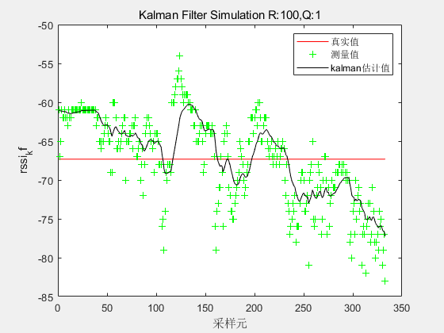
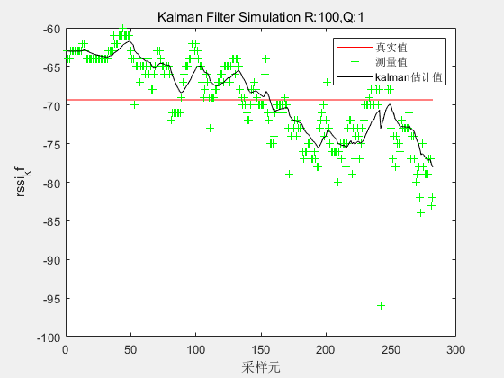
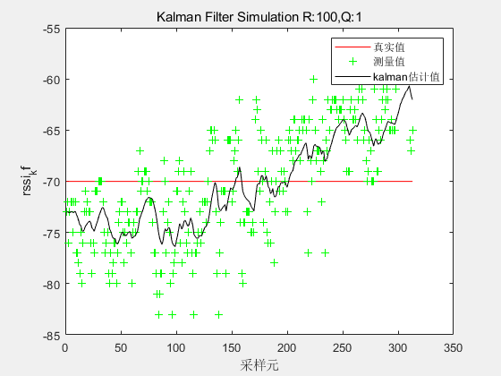
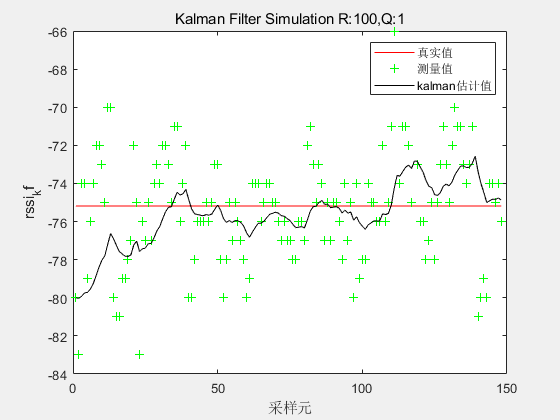

# Kalman Filtering

## 0x00

卡尔曼滤波器是一种利用线性系统，通过系统输入、输出观测数据对系统状态进行最优估计的算法。

- 卡尔曼滤波器能从测量方差已知的观测数据中估计出系统的最佳状态；
- 卡尔曼滤波器适用于线性、离散和有限维系统；
- 任何一组观测数据都不能消除状态变量$X(t)$ 的不确定性，卡尔曼增益同观测数据无关；
- 当观测和系统状态联合服从高斯分布时，用卡尔曼递归公式计算得到的是高斯随机变量的条件均值和条件方差，从而卡尔曼滤波公式给出了计算状态的条件概率密度的更行过程线性最小方差计算。

## 0x01

**前提条件：**

假设1：k时刻的真实状态是从k − 1 k-1k−1时刻的真实状态演化而来；
假设2：演化与测量的过程由线性算子来描述。

**四个状态值的定义：**

${\hat{x}_{k-1|k-1}}$ ：表示k-1时刻的估计状态；

$x_k$：表示k − 1 时刻的真实状态;

${\hat{x}_{k|k-1}}$ ：表示k-1时刻的估计状态预测k时刻估计的预测值；

${\hat{x}_{k|k}}$ ：表示k时刻的估计状态；

${x_k}$ ：表示k时刻的真实状态；

**状态转移方程：**

${x_k = F_kx_{k-1} + B_ku_k+\omega_k}$ 

- ${F_k}$：状态转移矩阵；
- ${B_k}$：输入矩阵；
- ${\omega_k}$：过程噪声，假定：均值为零，协方差矩阵为$Q_k$ 的多元独立正态分布，记作：$\omega_k,N(0,Q_k) ,Q_k = cov(\omega_k)$  。

**状态观测方程：**

${z_k = H_kx_k + v_k}$

- ${H_k}$ ：观测矩阵，将隐含的真实状态空间映射到观测空间；
- ${v_k}$ ：观测噪声，假定：均值为零，协方差矩阵为$R_k$ 的多元独立正态分布，记作：${v_k,N(0,R_k) ,R_k = cov(v_k)}$  。

`todo`

