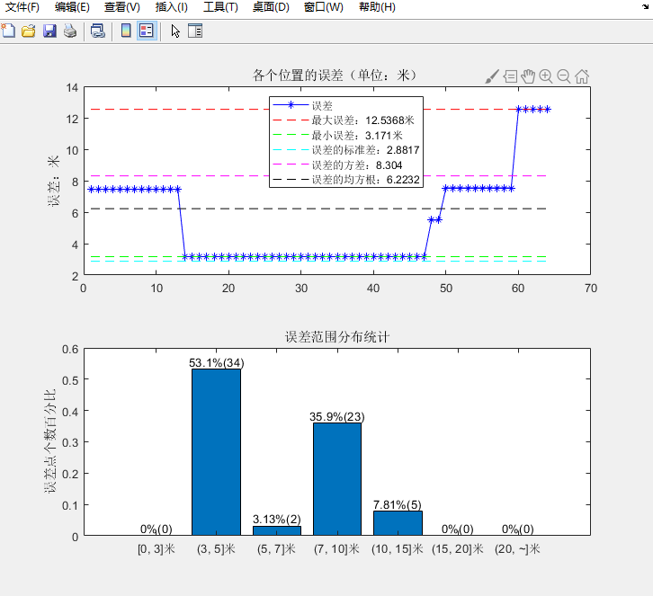
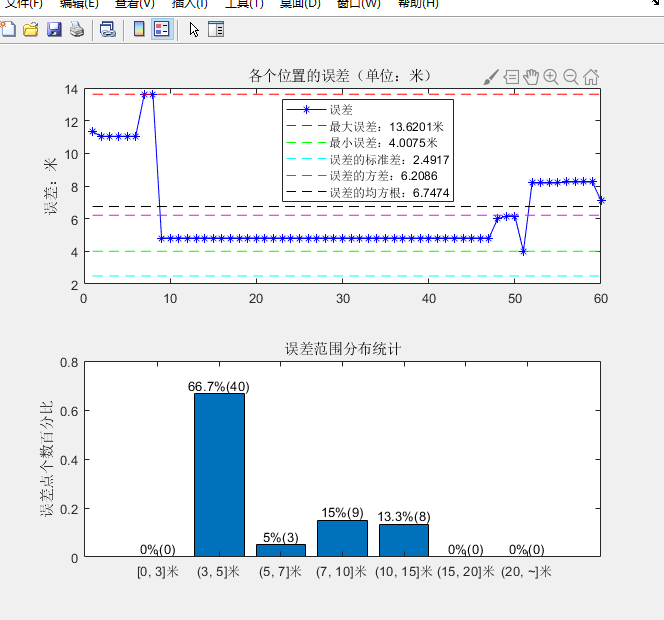
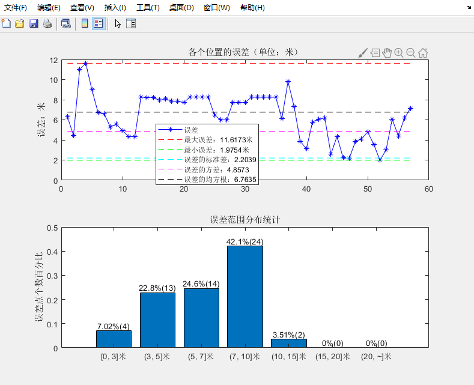
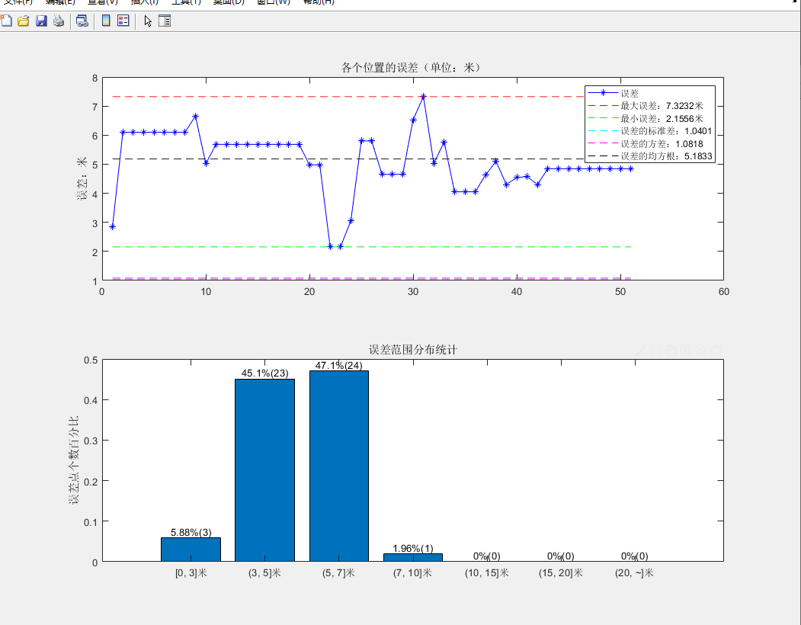
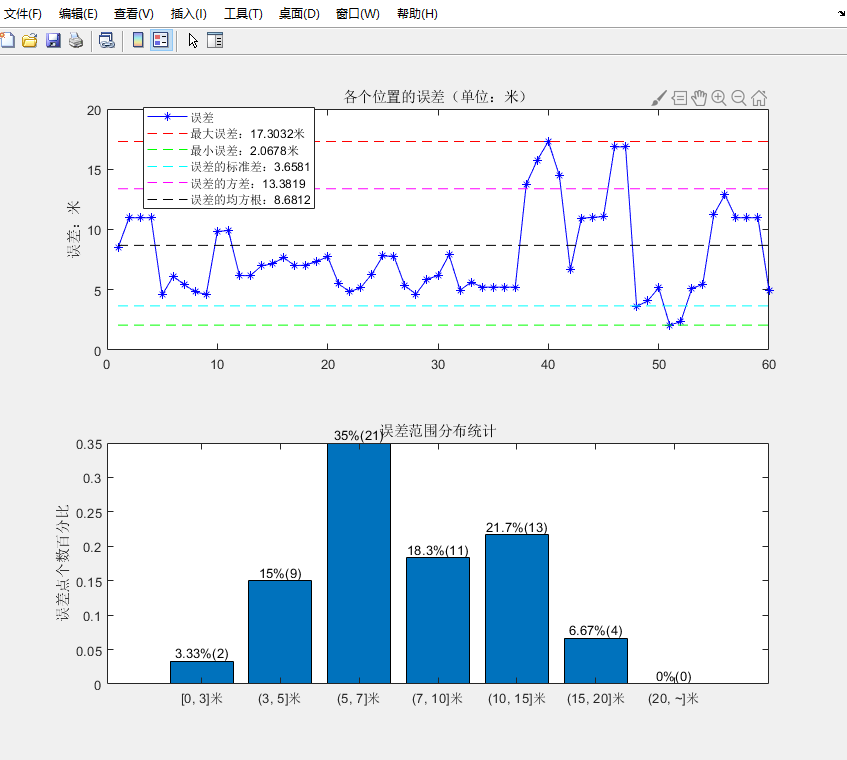
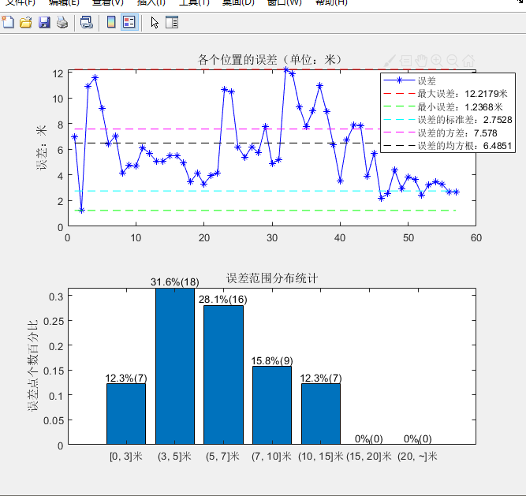
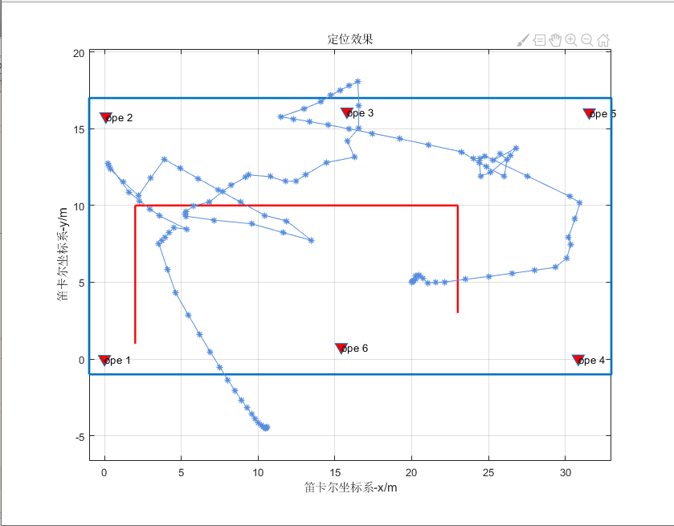

# 动静态定位结果分析

## 测试组-1

对数模型

$$
A= -17.91  (-34.24, -1.586)\\
n = 3.363  (1.758, 4.969)\\
A = -19.91;b = 3.363;
$$

<table border="1" bgcolor="green">
<tr>
<td align="center">三边定位算法</td>
<td align="center">定位点</td>
<td align="center">&nbsp</td>
</tr>
<tr>
<td align="center">加权高斯牛顿</td>
<td align="center">四点定位</td>
<td align="center">&nbsp</td>
</tr>
</table>

    
    
 static point -1 

    
    
 static point -2 

    
    
 static point -3 

## 测试组-2

<table border="1" bgcolor="green">
<tr>
<td align="center">三边定位算法</td>
<td align="center">定位点</td>
<td align="center">&nbsp</td>
</tr>
<tr>
<td align="center">加权高斯牛顿</td>
<td align="center">三点定位</td>
<td align="center">&nbsp</td>
</tr>
</table>

    
    
 static point -1 

    
    
 static point -2 

    
    
 static point -3 

    
    
 dynamic-1 

