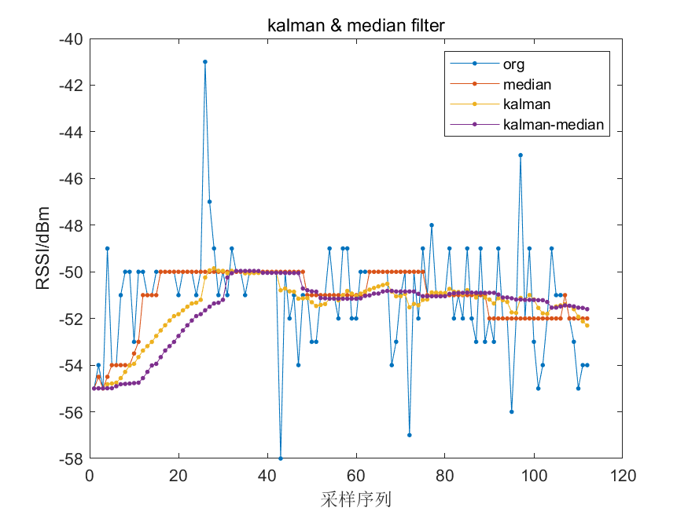
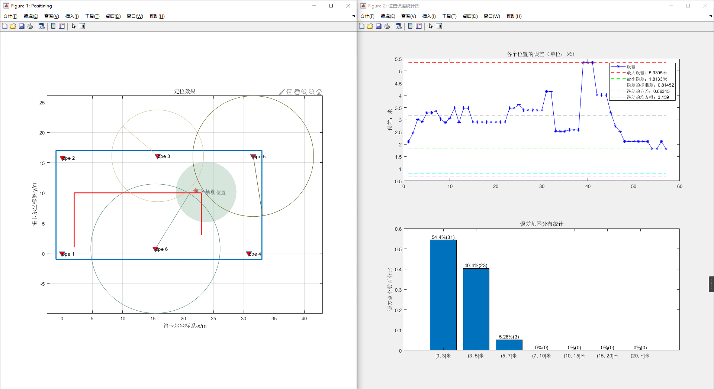

# 动静态定位结果分析

## 测试组-1

对数模型

$$
A= -17.91  (-34.24, -1.586)\\
n = 3.363  (1.758, 4.969)\\
A = -19.91;b = 3.363;
$$


<table border="1" bgcolor="green">
<tr>
<td align="center">三边定位算法</td>
<td align="center">定位点</td>
<td align="center">&nbsp</td>
</tr>
<tr>
<td align="center">加权高斯牛顿</td>
<td align="center">四点定位</td>
<td align="center">&nbsp</td>
</tr>
</table>

<div>
    
    <p align="center"> static point -1 </p>
</div>
<div>
    
    <p align="center"> static point -2 </p>
</div>
<div>
    
    <p align="center"> static point -3 </p>
</div>

## 测试组-2

<table border="1" bgcolor="green">
<tr>
<td align="center">三边定位算法</td>
<td align="center">定位点</td>
<td align="center">&nbsp</td>
</tr>
<tr>
<td align="center">加权高斯牛顿</td>
<td align="center">三点定位</td>
<td align="center">&nbsp</td>
</tr>
</table>
<div>
    
    <p align="center"> static point -1 </p>
</div>
<div>
    
    <p align="center"> static point -2 </p>
</div>
<div>
    
    <p align="center"> static point -3 </p>
</div>
<div>
    
    <p align="center"> dynamic-1 </p>
</div>
## kalman & median filter

### static 1

<div>
    
    <p align="center"> kalman-median-filtering-ope 1 </p>
</div>
<div>
    
    <p align="center"> kalman-median-filtering-ope 2 </p>
</div>
<div>
    
    <p align="center"> kalman-median-filtering-ope 6 </p>
</div>

### static 2 

<div>
    
    <p align="center"> kalman-median-filtering-ope 1 </p>
</div>
<div>
    
    <p align="center"> kalman-median-filtering-ope 2 </p>
</div>
<div>
    
    <p align="center"> kalman-median-filtering-ope 6 </p>
</div>

### static 3

<div>
    
    <p align="center"> kalman-median-filtering-ope 3 </p>
</div>
<div>
    
    <p align="center"> kalman-median-filtering-ope 4 </p>
</div>
<div>
    
    <p align="center"> kalman-median-filtering-ope 5 </p>
</div>


## 测试组-3

<div>
    
    <p align="center"> static point -1 </p>
</div>
<div>
    
    <p align="center"> static point -2 </p>
</div>
<div align="center">
    
    <p align="center"> static point -3 </p>
    <a href="D:\Code\BlueTooth\pos_bluetooth_matlab\Doc\img\position-3.png">static point-3</a>
</div>
<div>
    
    <p align="center"> dynamic-1 </p>
</div>


## 静态点RSSI测试对比

<div style="background-color:white">
    
</div>


## polynomial model

多项式拟合

```matlab
%%
clc;
% Linear model Poly2:
% f(x) = p1*x^2 + p2*x + p3
% where x is normalized by mean -47.11 and std 6.718
% Coefficients (with 95% confidence bounds):
% p1 =      0.8076  (-0.5569, 2.172)
% p2 =      -4.642  (-6.304, -2.98)
% p3 =       7.191  (5.202, 9.18)
poly_model_func = @(a, b, c, env, x)(a .* (x - env).^2 + b .* (x - env) + c);
rssi_x = linspace(min(mean_vals_ch39) - 15, max(mean_vals_ch39) + 5, 50);
% rssi_x = rssi_x ; % center
dist_y = poly_model_func(0.01789, 0.9949, 14.35, -10, rssi_x);
tcf('poly-model');
f1 = figure('name', 'poly-model', 'color', 'w');

plot(rssi_x, dist_y, 'Marker', '.')

```

<div style="background-color:white;text-align:center;">
    
</div>


## Key:

- [ ] 多次测试差异；
- [ ] 三信道操作；
- [ ] 为什么距离远了之后，rssi值变大；
- [ ] 如何解决rssi对应多个距离问题；

# Beacon测试结果

## 1.P1


## 2.P2


## 3.P3


## 4.P4


## 5.P5


## 6.P6


# 信道聚类-Clustering

### 单信道&混合信道测试


实验结果分析

|   信道   | 均值(dBm) | 最大波动值(dBm) | 标准差 |      |
| :------: | :-------: | :-------------: | :----: | ---- |
|   Ch37   |  -69.51   |       12        | 1.656  |      |
|   Ch38   |  -65.20   |       10        | 1.057  |      |
|   Ch39   |  -71.44   |        9        | 1.360  |      |
| ChFusion |  -68.76   |       15        | 3.285  |      |
|          |           |                 |        |      |


### 信道聚类测试


实验结果分析

信道分类结果五簇

| Clustering |    Value(dBm)     |      |
| :--------: | :---------------: | ---- |
|     1      | -74.4102564102564 |      |
|     2      | -72.3414634146342 |      |
|     3      | -68.2941176470588 |      |
|     4      | -66.7068965517241 |      |
|     5      | -64.6595744680851 |      |

信道分类结果三簇

| Clustering | Value(dBm) |      |
| :--------: | :--------: | ---- |
|     1      |  -73.350   |      |
|     2      |  -67.807   |      |
|     3      |  -64.865   |      |


