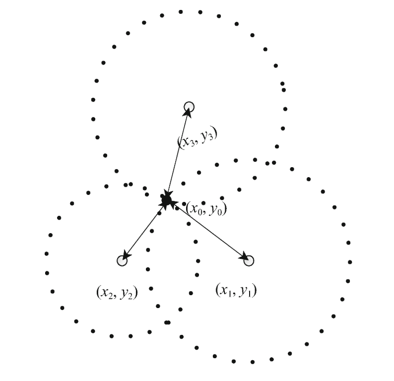
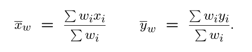

# Trilateration

## 问题描述

​	分布均匀的无线传感器网络由一组节点组成，包括锚节点(anchor nodes)和未知节点(unknown nodes)。每个节点都配备有信号收发器，当它们之间的欧式距离(Euclidean distance)小于特定的范围，可以进行通信。每个节点都可以通过某些测距技术（例如TDOA，RSSI或DV-HOP）测量到其他节点的距离。观测距离结果用公式（1）表示，其中${N(0,VD)}$ 是高斯白噪声。
$$
\begin{align}
& d_{measured} = d_{deal} + noise,noisen  \~  N(0,VD)
\end{align}
$$
​	假定一坐标为${(x_0,y_0)}$ 的未知结点 接收到N个信号 ${(x_1,y_1,d_1),...,(x_2,y_2,d_N)}$，理想条件下，有如下公式：
$$
\begin{align}
(x_1-x_0)^2 &+ (y_1-y_0)^2 = d_1^2 \\
(x_2-x_0)^2 &+ (y_2-y_0)^2 = d_2^2 \\
&.\\&.\\
(x_N-x_0)^2 &+ (y_N-y_0)^2 = d_N^2 \\
\end{align}
$$


如果$N \geq 3$ ，且锚节点不在同一条直线上，则能通过求解任意三个公式得到${(x_0,y_0)}$ 的值。


## 经典三边测距法（classical trilateration algorithm）

三边测距法中，二维平面中的解是以三个锚点为中心的三个圆的交点。如图一，实际上，所有以${(x_i,x_i)}$ 为圆心，以${d_i}$ 为半径的圆的交点为${(x_0,y_0)}$。然后，真实环境中， 这N个圆可能并不是相交于一个点，因此通常使用公式（3）中描述的目标函数来最小化未知节点的估计位置与实际位置之间的差异。 该方法即是最小二乘经典三边测距算法。




在正常条件中使用LS（least square）进行多边测试效果不错。 


但是如果存在较大噪声干扰下， 坐标估计值与真实坐标偏差会受到较大影响；

三边定位法计算方法：


## 三边定位+1

考虑以下情形，当测距结果$R_i$ 存在误差的情况。最小二乘问题由求解$Ax=b$ 变为${Ax+N=b}$ 。其中$N$ 表示随机向量误差。 $W$是加权矩阵, 为保证WLS是无偏估计或最小方差无偏估计, 加权矩阵$W$有特殊的要求, 在实际应用中一般要求$W$为对称正定矩阵。利用许瓦兹不等式可以证明, 在测距误差与距离之比为独立分布的高斯随机变量的条件下, 当${W=R^{-1}}$时, WLS的估计均方误差最小，$R$为测距误差的方差矩阵$R=E\{NN^T\}$。


### 几何约束&差法&最大似然

## 线性化方法

在估计点附近进行泰勒展开，忽略高阶项：


前向减后项法：

已知节点与未知节点的距离方程如下，


用前n-1项减去第n项则得到满足${AX=b}$的线性回归模型，


则可以套用线性最小二乘公式的结果：


$$
\begin{align}
&A = \left[ \begin{matrix}
2(x_1-x_3)&2(y_1-y_3)\\
2(x_2-x_3)&2(y_2-y_3)
\end{matrix}\right]\\
&b = \left[ \begin{matrix}
x_1^2-x_3^2+y_1^2-y_3^2+d_3^2-d_1^2\\
x_2^2-x_3^2+y_2^2-y_3^2+d_3^2-d_2^2
\end{matrix}\right]
\end{align}
$$


## 普通最小二乘（ordinary least square）

线性回归模型：
$$
\begin{align}
&\hat y = \beta x_i + \beta_0
\end{align}
$$

${y_i}$，表示数据${x_i}$的观测结果，即真实值，或者是观测的响应变量（observed response）；
${x_i}$，表示第${i}$个数据，即第${i}$个预测变量（predictor value）；
${\hat{y}_i}$，表示第${i}$个数据的实验结果，即预测的响应变量（predicted response）。

线性模型的形式：
$$
\begin{align}
& &\hat y = X\beta^T
\end{align}
$$
线性回归的目的是使目标函数最小：
$$
\begin{align}
& \hat{\beta} = argmin_{\beta}S(\beta)\\
&	S(\beta) = \sum_{i=1}^m|y_i - \sum_{j=1}^nx_{ij}\beta_j|^2=||Y-X\beta^T||^2
\end{align}
$$


普通最小二乘法要求残差满足Gauss-Markov假设，即：
$$
\begin{align}
&E(β0)=0\\
&Cov(\beta_0) = \sigma^2I\\
&Cov(\beta_0, x) = 0
\end{align}
$$
残差的期望为0，协方差是单位矩阵，与自变量的协方差为0。

## 加权最小二乘(weighted least squares)

### #1 OLS假设

​	标准的线性回归假定残差满足Gauss-Markov假设即：${Var(\epsilon_i) = \delta^2,i=1...n.}$（同方差）。然而，实际存在以下情况：

${Var(Y|X=x_i)=Var(\epsilon_i) = \frac{\delta^2}{\omega_i}}$，其中${\omega_i}$ 为正常数。加权最小二乘是一种估计方法，它将与观测值的误差方差的倒数成比例的方式对观测值进行加权，从而解决异方差的问题。

### #2 WLS简单回归

​	假设存在以下模型：
$$
\begin{align}
&Y_i = \beta_0 + \beta_1X_i + \epsilon_i,i=1,...,n\\
& 其中，\epsilon_i~N(0,\delta^2/\omega_i)，且\omega_i为**已知**常量；
\end{align}
$$
β0和β1的加权最小二乘估计使得目标最小：
$$
\begin{align}
& S_w(\beta_0,\beta_1) = \sum_{i=1}^n\omega_i(y_i-\beta_0-\beta_1x_i)^2\\
\end{align}
$$
在这个加权平方和中，权重与相应的方差成反比； 方差小的点将被赋予较高的权重，方差较大的点将被赋予较低的权重。

加权最小二乘估计值如下：


其中：


加权最小二乘同样是无偏估计。

接下来讨论参数估计结果的方差：


由于估算结果可以用正态随机变量来表示，因此采样分布仍然是正态的。加权误差均方${S_w(\hat{\beta_0},\hat{\beta_1})/(n-2) }$ 是${\delta^2}$ 的无偏估计。

### #3 WLS常规解法

​	${W}$ 是对角元数为${w_1,...w_n}$的对角矩阵。加权残差平方和定义为：


加权最小二乘可通过最小化平方和来找到β的估计值，其解为：


通过线性化方式转换后的三边定位算法矩阵表达式如下：


### #4 加权最小二乘不同变换形式

回顾上一章的模型，


我们可以通过如下变化将其转化为一般最小二乘问题：


转换后模型的残差平方和为：


残差平方和权重系数为${w_i=1/x_i^2}$，因此，加权最小二乘解与变换模式的常规最小二乘解相同。

一般形式线性模型：


${W^{1/2}}$ 为元素为${\sqrt{w_i}}$ 的对角矩阵，则${Var(W^{1/2}\epsilon) = \delta^2I_n}$ 。

因此，将其变换为


这样就变成一般最小二乘的形式：


根据一般最小二乘法结论，其解为：


### #5 加权最小二乘的优点

- 在转换后的模型中，系数估计的可能很困难。 在加权最小二乘中，可以通过转换后进行求解；
- 在转换后的模型中，通常不会出现截距，这意味着F检验和R平方值相当不同。 在加权最小二乘中，我们通常包括保留对这些数量的通常解释的截距。
- 加权最小二乘设置权重等于0，为我们提供了一种从模型中删除一个观测值的简便方法。
- 还可以降低异常值或有影响力的点，以减少它们对整体模式的影响。

### #6 权重系数

​	为了使用加权最小二乘，必须事先知道其权重系数。一些情况下，我们可能有一个概率模型${Var(Y|X=x_i)=Var(\epsilon_i) = \frac{\delta^2}{\omega_i}}$来求解其系数值${w_i}$。例如，对于泊松数据，如果期望${x}$和${Var(Y|X=x_i)}$满足正相关，我们可以使用${w_i=1/x_i}$作为系数。

​	另一个常见的情况是，每个观察值都不是单一度量，而是多个原始度量的均值且原始度量均具有方差σ2。在这种情况下，


因此，我们将使用加权的最小二乘法系数为${w_i=n_i}$；这种情况通常发生在集群调查中（ `cluster surveys`）。

### #7 未知权重

​	在许多现实情况中，先验权重是未知的，在这种情况下，我们需要估计权重才能使用加权最小二乘。通过统计的方法求其方差，作为其权重。

### #8  迭代算法与加权最小二乘

适用性方法：从目标函数出发的方法，Gauss-Newton法、梯度下降法；


## LS（least square）

​	基于均方误差最小化来进行模型求解的方法称 为"最小二乘法" (least squqare method)。用LS进行多边定位是为了最大程度地减少估计位置$(\hat{x}_0 ,\hat{y}_0)$与节点的实际位置${(x_0,y_0)}$之间的差异。该方法通常涉及迭代搜索技术，例如梯度下降或牛顿法。为了避免出现局部最小值，LS必须以不同的初始起点多次运算，这会导致计算消耗大。 此外，它很容易受到位置偏移的影响，因为它试图在所有样本（包括那些大偏差样本）上实现全局最优。


## Linear  least squares & Nonlinear least squares

误差函数${f(x)}$ 与待拟合参数$b$ 之间的线性关系决定；

线性函数具有如下两个性质：
$$
\begin{align}
& f(ax) = af(x)\\
& f(x_1+x_2) = f(x_1) + f(x_2)\\
\end{align}
$$


## LMS(Least median squares)


## Linear LMS(Linear Least median squares)


$@Book{Gao2017SLAM, title={视觉SLAM十四讲：从理论到实践}, publisher = {电子工业出版社}, year = {2017}, author = {高翔 and 张涛 and 刘毅 and 颜沁睿}, lang = {zh} }$

## 梯度下降法(gradient descent)

### 梯度（微分）

​	单变量函数，在定义某点上的梯度就是其微分，代表着函数在某个给定点的切线的斜率；对于多变量函数而言，在某点的梯度为各自变量的偏导数的向量，向量有方向，梯度的方向就指出了函数在给定点的上升最快的方向。

$$
\begin{align}
&目标函数：F(x_1,x_2,...,x_n)\\
&梯度：∇F = [\frac{∂F}{∂x_1},\frac{∂F}{∂x_2}...,\frac{∂F}{∂x_n}]
\end{align}
$$
三边定位模型（加权损失函数-loss function）：


$$
\begin{align}
&(\hat{x}_0,\hat{y}_0) = arg min\sum_{i=1}^{N}\omega_i[\sqrt{(x_i-x_0)^2+(y_i-y_0)^2}-d_i]^2\\
& 其中 \omega_i 是权重系数；
\end{align}
$$

### 梯度下降法

$$
\begin{align}
&目标函数：F(x_1,x_2,...,x_n)\\
&梯度：∇F = [\frac{∂F}{∂x_1},\frac{∂F}{∂x_2}...,\frac{∂F}{∂x_n}]\\
& x_{k+1} = x_{k} - \alpha∇F(x_k)\\
& \alpha:步长(学习率)\\
\end{align}
$$


### 三边定位算法

$$
\begin{align}
&(\hat{x}_0,\hat{y}_0) = arg min\frac{1}{2}\sum_{i=1}^{N}\omega_i[\sqrt{(x_i-x_0)^2+(y_i-y_0)^2}-d_i]^2\\
& 其中 \omega_i 是权重系数；\\
& 目标函数：
F = \frac{1}{2}\sum_{i=1}^{N}\omega_i[\sqrt{(x_i-x_0)^2+(y_i-y_0)^2}-d_i]^2...(1)\\
&F = \sum_{i=1}^{N}\omega_i[(x_i-x_0)^2+(y_i-y_0)^2-2d_i\sqrt{(x_i-x_0)^2+(y_i-y_0)^2}+d_i^2]...(2)\\
&\frac{∂F}{∂x_0} = \sum\omega_i[(x_0-x_i)-\frac{d_i(x_0-x_i)}{\sqrt{(x_i-x_0)^2+(y_i-y_0)^2}}]...(3)\\
&\frac{∂F}{∂y_0} = \sum\omega_i[(y_0-y_i)-\frac{d_i(y_0-y_i)}{\sqrt{(x_i-x_0)^2+(y_i-y_0)^2}}]...(4)\\
&∇F = (\frac{∂F}{∂x_0},\frac{∂F}{∂y_0})...(5)\\
&负梯度方向：-∇F = -(\frac{∂F}{∂x_0},\frac{∂F}{∂y_0})...(6)\\
\end{align}
$$


**伪代码**

```
1.初始化位置(x0,y0)——质心;
2.X(k+1)=X(K)-alpha*∇F(Xk),alpha为步长(学习率)；
3.|X(k+1)-x(k)| < delta 结束否则转到步骤2；
```

## 加权高斯-牛顿（Weighted Gauss-Newton）


## 数学知识

### 雅各比矩阵(Jacobian Matrix)

若在n维欧式空间中的一个向量映射成m维欧式空间中的另一个向量的对应法则为F，F由m个实函数组成，即：


那么雅可比矩阵是一个m×n矩阵：


 

其中输入向量x = (x1, ... , xn)，输出向量y = (y1, ..., ym)， 


## Reference

1. [Trilateration三边测量定位算法](https://www.cnblogs.com/sddai/p/5663463.html)
2. 最小二乘 https://zhuanlan.zhihu.com/p/38128785
3. [最小二乘问题的四种解法——牛顿法，梯度下降法，高斯牛顿法和列文伯格-马夸特法的区别和联系](https://zhuanlan.zhihu.com/p/113946848)
4. 最小二乘法定位（2）——定位算法+仿真程序https://blog.csdn.net/qq_30093417/article/details/88944169
5. 最小二乘法节点定位（1）——小知识：非线性方程线性化https://blog.csdn.net/qq_30093417/article/details/86681364
6. [使用三边定位算法进行室内定位](https://blog.csdn.net/huangzhichang13/article/details/76076958)
7. 使用三邊定位演算法進行室內定位https://www.itread01.com/content/1546576765.html
8. 采用三边定位算法对未知节点进行估算https://www.cnblogs.com/Aaron12/p/7646841.html
9. [数值分析](http://www.math.ecnu.edu.cn/~jypan/Teaching/NA/index.html)
10. IndoorPos https://codechina.csdn.net/mirrors/megagao/indoorpos?utm_source=csdn_github_accelerator
11. matlab优化工具箱 https://ww2.mathworks.cn/help/optim/index.html?s_cid=doc_ftr
12. [梯度下降法(梯度下降法，牛顿法，高斯牛顿法，Levenberg-Marquardt算法)](https://www.cnblogs.com/zhizhan/p/5279672.html)
13. 高斯牛顿算法 https://en.m.wikipedia.org/wiki/Gauss%E2%80%93Newton_algorithm 
14. [MATLAB 高斯牛顿法最优化](https://www.cnblogs.com/ybqjymy/p/13645624.html)
15. [matlab实现高斯牛顿法、Levenberg–Marquardt方法](https://www.cnblogs.com/wsine/p/4634581.html)
16. [Jacobian矩阵和Hessian矩阵](http://jacoxu.com/jacobian%e7%9f%a9%e9%98%b5%e5%92%8chessian%e7%9f%a9%e9%98%b5/)
17. [最小二乘法（Least Squares）详细介绍 | 数据学习者官方网站(Datalearner)](https://www.datalearner.com/blog/1051539222770649)
18. [高斯-马尔可夫定理 - 维基百科，自由的百科全书 (wikipedia.org)](https://zh.wikipedia.org/wiki/高斯-马尔可夫定理)
19. wls[Lectures7.pdf (mcmaster.ca)](https://ms.mcmaster.ca/canty/teaching/stat3a03/Lectures7.pdf)
20. [Welcome to STAT 501! | STAT 501 (psu.edu)](https://online.stat.psu.edu/stat501/lesson/welcome-stat-501)
21. [[数值计算] 数据拟合——非线性最小二乘法](https://zhuanlan.zhihu.com/p/83320557)
22. [线性回归和局部加权线性回归](https://www.cnblogs.com/MrLJC/p/4147697.html)
23. [最小二乘法—多项式拟合非线性函数 - 简书 (jianshu.com)](https://www.jianshu.com/p/af0a4f71c05a)
24. [直观理解梯度，以及偏导数、方向导数和法向量等 - shine-lee - 博客园 (cnblogs.com)](https://www.cnblogs.com/shine-lee/p/11715033.html)
25. [常用的梯度下降优化算法 | 明天探索者 (seanlee97.github.io)](https://seanlee97.github.io/2018/10/01/常用的梯度下降优化算法/)
26. [梯度下降算法 线性回归拟合（附Python/Matlab/Julia源代码） - 知乎 (zhihu.com)](https://zhuanlan.zhihu.com/p/63799123)
27. [[数值计算\] 数据拟合——非线性最小二乘法 - 知乎 (zhihu.com)](https://zhuanlan.zhihu.com/p/83320557)
28. [Nonlinear Least-Squares Fitting — GSL 2.6 documentation (gnu.org)](https://www.gnu.org/software/gsl/doc/html/nls.html?highlight=levenberg marquardt algorithm#:~:text=Weighted nonlinear least-squares fitting minimizes the function where,in the same form as the unweighted case.)
29. [2.2 - Weighted Gauss-Newton Optimization on Lie-Manifolds · LSD-SLAM : 基于直接法的大范围单目同步定位和地图构建方法 (gitbooks.io)](https://stormtiti.gitbooks.io/lsd-slam/content/preliminaires/2.2-weighted-gauss-newton-optimization-on-lie-manifolds.html)
30. [Gauss-Newton算法学习_Where there is life, there is hope-CSDN博客](https://blog.csdn.net/jinshengtao/article/details/51615162)
31. [最优化理论与算法------牛顿法（附Matlab实现）： - YuhuaStone - 博客园 (cnblogs.com)](https://www.cnblogs.com/yuhuastone/p/12814752.html)
32. [数字信号处理４——高斯牛顿法与matlab实例_qinze5857的博客-CSDN博客](https://blog.csdn.net/qinze5857/article/details/109483432)
33. [rssi [Bluetooth® LE Wiki\] (bluetoothle.wiki)](https://www.bluetoothle.wiki/rssi)
34. [加权最小二乘估计在无线传感器网络定位中的应用 - 百度学术 (baidu.com)](https://xueshu.baidu.com/usercenter/paper/show?paperid=71959eb3f55b113ff2fa48150e49e46a)

