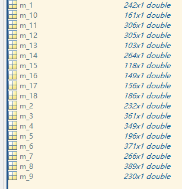
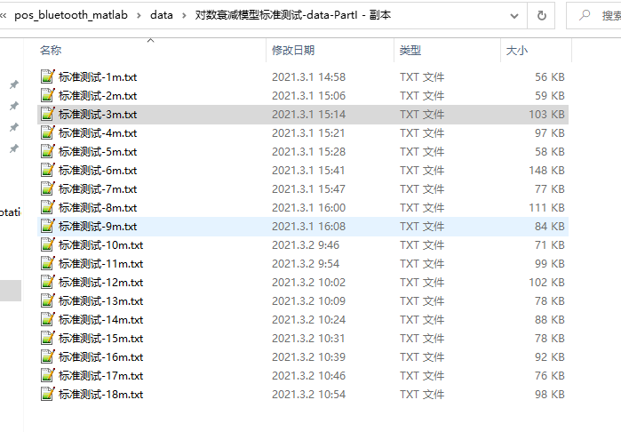

# 对数衰减模型标准实验

## 1、实验说明

为了进行对蓝牙信号传播模型中路径损耗与信号传播距离之间的关系有一个较为直观、清晰地认识。设计了此实验。

实验说明：

该实验在较为理想的情况下进行：

- 蓝牙发射和接收模块放置于同一水平高度；
- 蓝牙功率等级：
- 蓝牙发射和接收模块中间空旷无遮挡（偶尔有人通过）;

## 2、实验数据

### 2.1、基本实验数据

**数据命名格式：** 标准测试-nm.txt 表示 发射和接受装置之间的距离为n m。

e.g: 标准测试-3m.txt 

注：

提取的距离对应RSSI值以数组形式保存在：

**D:\Code\BlueTooth\pos_bluetooth_matlab\data\std_diss.mat**

原始数据保存在：

**D:\Code\BlueTooth\pos_bluetooth_matlab\data\对数衰减模型标准测试-data-PartI - 副本**

### 2.2、实验数据清洗

## 3、实验结果

