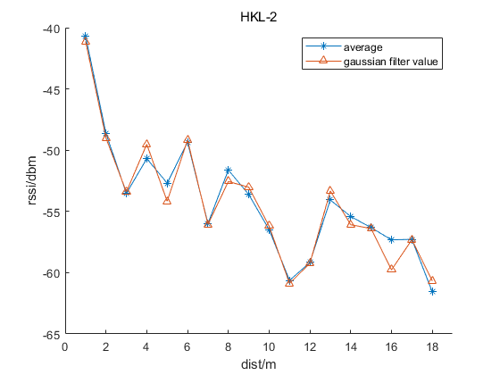
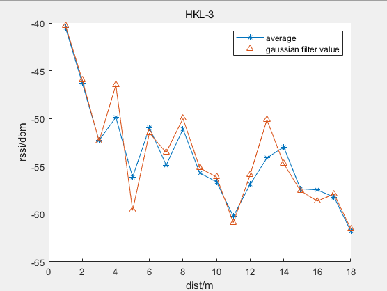
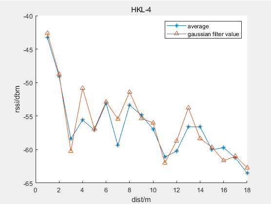
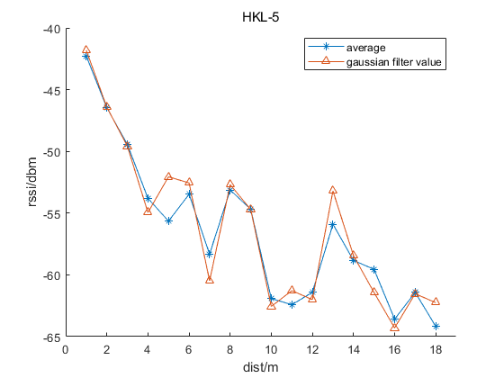
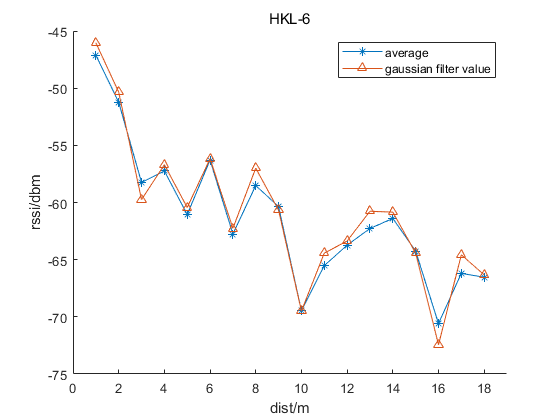
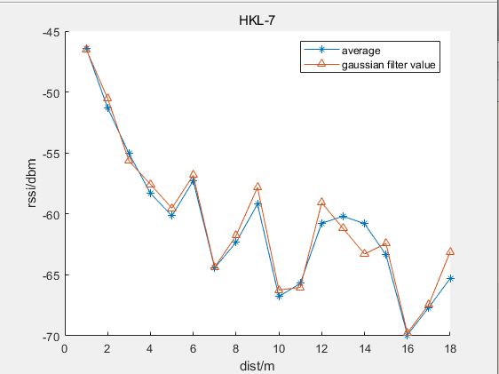
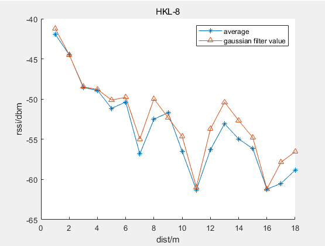

# Gaussian filter & Average 

## 1、对数衰减模型（Log-normal shadowing model）

  为了获取先验的对数衰减模型，需要在固定距离上对RSSI进行多次测量，以获取最优的距离$d$ 对应RSSI值$RSSI(d)$。由于各种环境因素的影响，原始RSSI测量值可能会有很大差异。为了提高定位精度，降低观测噪声的影响。因此将采集的原有RSSI值同均值滤波和Gaussian滤波效果进行对比。

## 2、Gaussian  distribution 

通过在该范围内选择RSSI，然后选择平均值作为从锚节点接收到的目标节点的RSSI测量值，即可获得RSSI的几何平均值。

## 3、高斯滤波实验结果

3.1 测试结果1

<file:D:\Code\BlueTooth\pos_bluetooth_matlab\attenuation_model\figure\gaussian-filter-HLK-1.fig>

图中，average表示对固定距离采集的RSSI所有数据取均值的结果。gaussian filter value 表示对固定距离采集的RSSI所有数据进行Gaussian滤波的结果。HLK-1表示蓝牙设备1。

3.2 测试结果2

<file:D:\Code\BlueTooth\pos_bluetooth_matlab\attenuation_model\figure\gaussian-filter-HLK-2.fig>

3.3 测试结果3

<file:D:\Code\BlueTooth\pos_bluetooth_matlab\attenuation_model\figure\gaussian-filter-HLK-3.fig>

3.4 测试结果4

<file:D:\Code\BlueTooth\pos_bluetooth_matlab\attenuation_model\figure\gaussian-filter-HLK-4.fig>

3.5 测试结果5

<file:D:\Code\BlueTooth\pos_bluetooth_matlab\attenuation_model\figure\gaussian-filter-HLK-5.fig>

3.6 测试结果6

<file:D:\Code\BlueTooth\pos_bluetooth_matlab\attenuation_model\figure\gaussian-filter-HLK-6.fig>

3.7 测试结果7

<file:D:\Code\BlueTooth\pos_bluetooth_matlab\attenuation_model\figure\gaussian-filter-HLK-7.fig>

3.8 测试结果8

<file:D:\Code\BlueTooth\pos_bluetooth_matlab\attenuation_model\figure\gaussian-filter-HLK-8.fig>

## 4、对RSSI进行kalman滤波

滤波结果&均值结果&原始数据对比如图：

<file:D:\Code\BlueTooth\pos_bluetooth_matlab\attenuation_model\figure\rssi-kalman-filter-1.fig>

从滤波结果看，将过程噪声协方差(矩阵)Q设置为0.01，观测噪声协方差（矩阵）R设置为100。滤波结果出现类似规律振荡。且最终收敛到几何均值附近。

## 5、拟合效果评估标准

### 5.1 SSE

SSE(和方差、误差平方和)：The sum of squares due to error.
$$
\begin{align}
& SSE = \sum_{i=1}^{n}(y_i - \hat{y}_i)^2
\end{align}
$$
$y_i$ 、$\hat{y}_i$ 分表表示原始数据和拟合模型的第$i$ 个值。SSE越接近于0，说明模型选择和拟合更好，数据预测也越成功。

类似预测结果还有：

MSE(均方差、方差)：Mean squared error。
RMSE(均方根、标准差)：Root mean squared error。

### 5.2 R-square(R^2)

R-square(确定系数)：Coefficient of determination。

$R^2$决定系数由总离差平方和（Total sum of squares,SST）和回归平方和（Sum of squares of the regression,SSR）共同决定。
$$
\begin{align}
& 预测数据与原始数据均值之差的平方和:\\
& SSR = \sum_{i=1}^N(\hat{y}_i - \bar{y})^2\\
& 原始数据和均值之差的平方和:\\
& SST = \sum_{i=1}^N(\hat{y} - \bar{y})^2\\
& R-square = \frac{SSR}{SST} = 1-\frac{SSE}{SST}\\
\end{align}
$$
其实“确定系数”是通过数据的变化来表征一个拟合的好坏。由上面的表达式可以知道“确定系数”的正常取值范围为[0 1]，越接近1，表明方程的变量对y的解释能力越强，这个模型对数据拟合的也较好。

## 6、拟合多项式和对数模型

## 7、Reference

1.[Microsoft PowerPoint - Image Filtering-6.ppt [Compatibility Mode\] (auckland.ac.nz)](https://www.cs.auckland.ac.nz/courses/compsci373s1c/PatricesLectures/Gaussian Filtering_1up.pdf)

2.[MATLAB拟合中SSE，MSE，RMSE，R-square,Adjusted R-quuare含义_qhsong的博客-CSDN博客](https://blog.csdn.net/qq_25614747/article/details/55194007?utm_medium=distribute.pc_relevant.none-task-blog-baidujs_title-0&spm=1001.2101.3001.4242)

