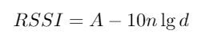
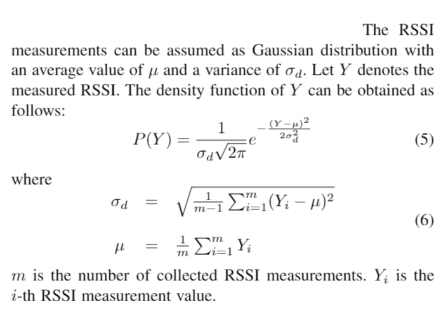
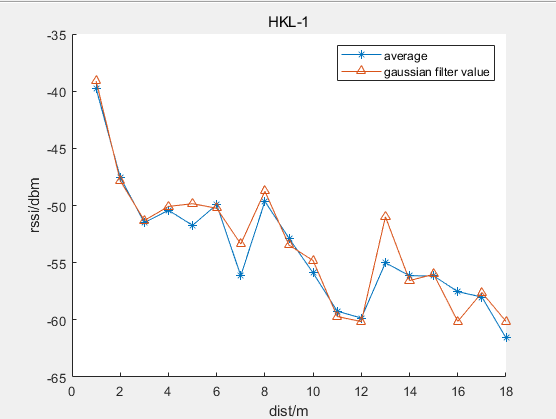
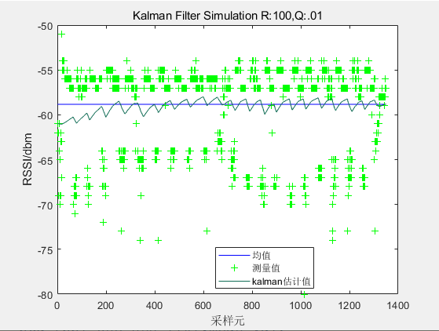

# Gaussian filter & Average 

## 1、对数衰减模型（Log-normal shadowing model）

  为了获取先验的对数衰减模型，需要在固定距离上对RSSI进行多次测量，以获取最优的距离$d$ 对应RSSI值$RSSI(d)$。由于各种环境因素的影响，原始RSSI测量值可能会有很大差异。为了提高定位精度，降低观测噪声的影响。因此将采集的原有RSSI值同均值滤波和Gaussian滤波效果进行对比。

## 2、Gaussian  distribution 

通过在该范围内选择RSSI，然后选择平均值作为从锚节点接收到的目标节点的RSSI测量值，即可获得RSSI的几何平均值。

## 3、仿真结果对比

3.1 测试结果1

<file:D:\Code\BlueTooth\pos_bluetooth_matlab\attenuation_model\figure\gaussian-filter-HLK-1.fig>

3.1 测试结果2

## 4、对RSSI进行kalman滤波

滤波结果&均值结果&原始数据对比如图：

<file:D:\Code\BlueTooth\pos_bluetooth_matlab\attenuation_model\figure\rssi-kalman-filter-1.fig>

从滤波结果看，将过程噪声协方差(矩阵)Q设置为0.01，观测噪声协方差（矩阵）R设置为100。滤波结果出现类似规律振荡。且最终收敛到几何均值附近。

## 4、Reference

1.[Microsoft PowerPoint - Image Filtering-6.ppt [Compatibility Mode\] (auckland.ac.nz)](https://www.cs.auckland.ac.nz/courses/compsci373s1c/PatricesLectures/Gaussian Filtering_1up.pdf)