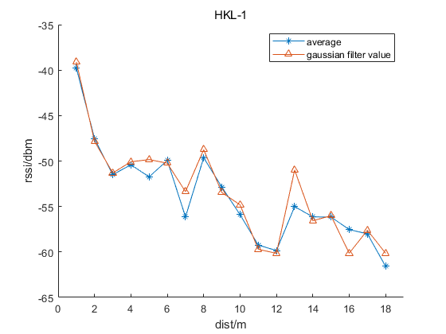
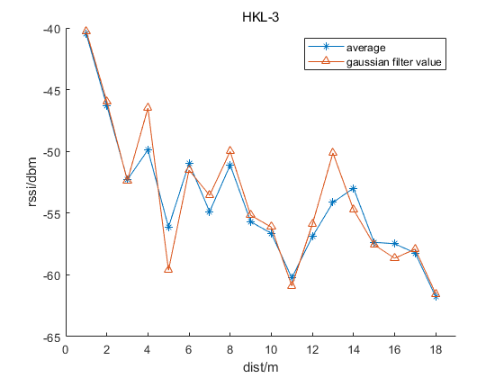
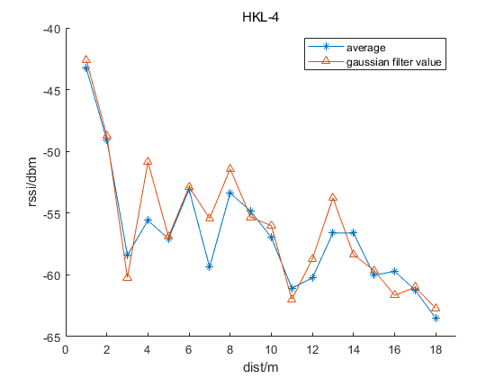
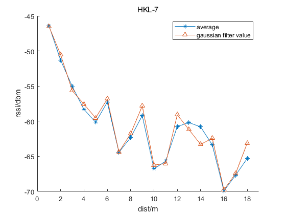
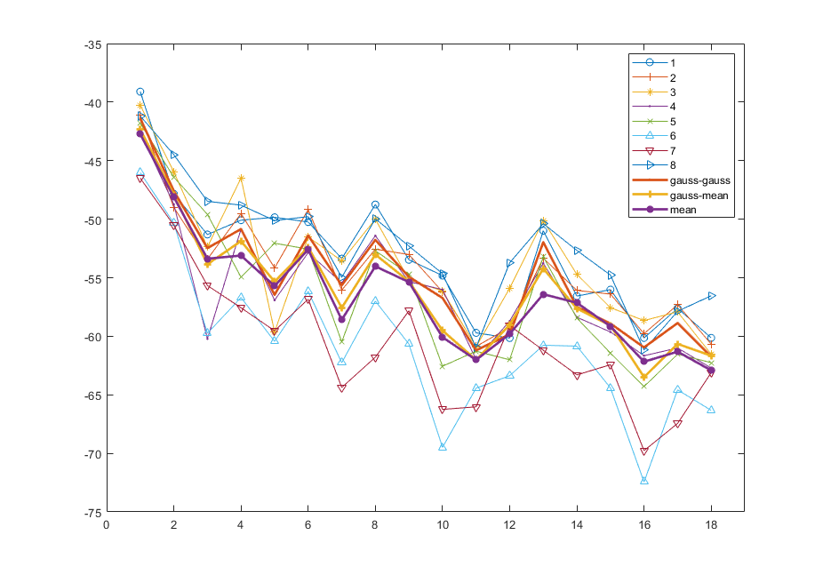

# Gaussian filter & Average 

## 1、对数衰减模型（Log-normal shadowing model）

  为了获取先验的对数衰减模型，需要在固定距离上对RSSI进行多次测量，以获取最优的距离$d$ 对应RSSI值$RSSI(d)$。由于各种环境因素的影响，原始RSSI测量值可能会有很大差异。为了提高定位精度，降低观测噪声的影响。因此将采集的原有RSSI值同均值滤波和Gaussian滤波效果进行对比。

## 2、Gaussian  distribution 

通过在该范围内选择RSSI，然后选择平均值作为从锚节点接收到的目标节点的RSSI测量值，即可获得RSSI的几何平均值。

## 3、高斯滤波实验结果

3.1 测试结果1

<file:D:\Code\BlueTooth\pos_bluetooth_matlab\attenuation_model\figure\gaussian-filter-HLK-1.fig>

图中，average表示对固定距离采集的RSSI所有数据取均值的结果。gaussian filter value 表示对固定距离采集的RSSI所有数据进行Gaussian滤波的结果。HLK-1表示蓝牙设备1。

3.2 测试结果2

<file:D:\Code\BlueTooth\pos_bluetooth_matlab\attenuation_model\figure\gaussian-filter-HLK-2.fig>

3.3 测试结果3

<file:D:\Code\BlueTooth\pos_bluetooth_matlab\attenuation_model\figure\gaussian-filter-HLK-3.fig>

3.4 测试结果4

<file:D:\Code\BlueTooth\pos_bluetooth_matlab\attenuation_model\figure\gaussian-filter-HLK-4.fig>

3.5 测试结果5

<file:D:\Code\BlueTooth\pos_bluetooth_matlab\attenuation_model\figure\gaussian-filter-HLK-5.fig>

3.6 测试结果6

<file:D:\Code\BlueTooth\pos_bluetooth_matlab\attenuation_model\figure\gaussian-filter-HLK-6.fig>

3.7 测试结果7

<file:D:\Code\BlueTooth\pos_bluetooth_matlab\attenuation_model\figure\gaussian-filter-HLK-7.fig>

3.8 测试结果8

<file:D:\Code\BlueTooth\pos_bluetooth_matlab\attenuation_model\figure\gaussian-filter-HLK-8.fig>

整体对比图

图中的：

gauss-gauss曲线，为对不同蓝牙信标固定距离对应的所有RSSI使用σ为1的高斯滤波，并对滤波后的数据再次使用σ为1的高斯滤波后结果。

图中的gauss-mean曲线，为对不同蓝牙信标固定距离对应的所有RSSI使用σ为1的高斯滤波，并对滤波后的数据取均值后的结果。

mean曲线为对不同蓝牙信标固定距离对应的所有RSSI取均值的结果。

​	<file:D:\Code\BlueTooth\pos_bluetooth_matlab\attenuation_model\doc\img\gaussian-mean-1.fig>

​	从上述实验结果看，对不同蓝牙信标固定距离下采集的RSSI分别进行高斯滤波（δ = 1）后取均值和对采集的RSSI直接进行均值得到的d-RSSI(距离-RSSI)曲线不同，从拟合对数模型角度看，没有较为明显的影响。此外不同的蓝牙信标d-RSSI的趋势不同。距离为1m时(参考RSSI值)，存在两个不同的RSSI区间，分别为-42dbm和-47dbm，分别有5个和2两个信标，其中最大的RSSI参考值为onepos_HLK_1，约为-39dbm。

​	蓝牙信标，在前半段(d<5m)能够基本符合对数曲线变化趋势，后半段(d>5m)呈现较为复杂的变化趋势，距离与RSSI的对应值并非呈现完全的反向变化关系，而是为波动下降，且波动幅值大。Max_RSSI(最大RSSI)值和Min_RSSI(最小RSSI)差值的平绝对值为7dbm。

​	不同蓝牙信标所采集的标准数据进行高斯滤波和均值滤波结果看，都随距离增大，RSSI值波动减小的趋势，且波动值gauss-gauss > gauss-mean > mean。

**波动大小和真实距离-RSSI关系？？？**

## 4、对RSSI进行kalman滤波

滤波结果&均值结果&原始数据对比如图：

<file:D:\Code\BlueTooth\pos_bluetooth_matlab\attenuation_model\figure\rssi-kalman-filter-1.fig>

从滤波结果看，将过程噪声协方差(矩阵)Q设置为0.01，观测噪声协方差（矩阵）R设置为100。滤波结果出现类似规律振荡。且最终收敛到几何均值附近。

## 5、单距离RSSI进行Gauss-Kalman滤波

​	对于短时间内接收到的RSSI数据，先使用Gauss Filter 选择出现概率大的RSSI-G值，然后再对RSSI-G使用Kalman滤波得到RSSI-GK作为最终的RSSI值输出。

从仿真结果看，原始数据origin为固定距离下的RSSI采样序列。理想情况下，RSSI值应该为一个固定值，实际情况下存在较大的波动，最大RSSI和最小RSSI值的差异为15dbm，不能直接作为对数路径损耗模型的输入。kalman为对origin使用Q为0.01，R= var(RSSI)=4.125的kalman滤波后的结果。相比较于origin数据，kalman平滑性显著提高，且在均值附近存现±1.25dbm的波动。mean为所有origin RSSI采样的均值，均值大小为-37.65dbm。gauss-kalman为先对origin使用动态高斯模型σ为2的高斯滤波后再对其进行Q=0.01，R = var(gauss)的kalman滤波结果，采样数据较少的时候，输出结果和kalman类似，当采样数据增多的时候其逐渐收敛为一个固定值，为-37.43dbm。

## 6、Reference

1.[Microsoft PowerPoint - Image Filtering-6.ppt [Compatibility Mode\] (auckland.ac.nz)](https://www.cs.auckland.ac.nz/courses/compsci373s1c/PatricesLectures/Gaussian Filtering_1up.pdf)

2.[MATLAB拟合中SSE，MSE，RMSE，R-square,Adjusted R-quuare含义_qhsong的博客-CSDN博客](https://blog.csdn.net/qq_25614747/article/details/55194007?utm_medium=distribute.pc_relevant.none-task-blog-baidujs_title-0&spm=1001.2101.3001.4242)

3.[(PDF) An RFID Indoor Positioning Algorithm Based on Support Vector Regression (researchgate.net)](https://www.researchgate.net/publication/325086060_An_RFID_Indoor_Positioning_Algorithm_Based_on_Support_Vector_Regression)
