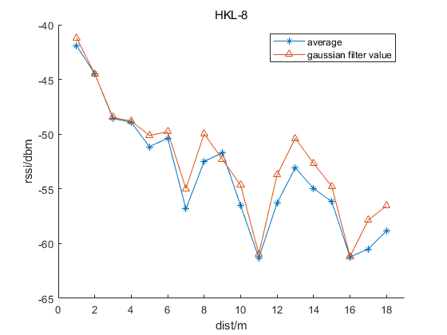
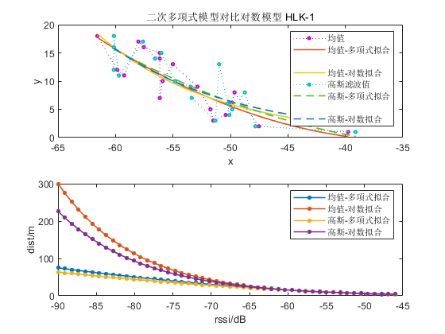
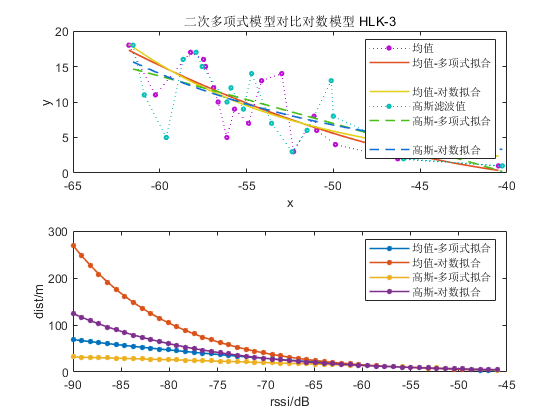
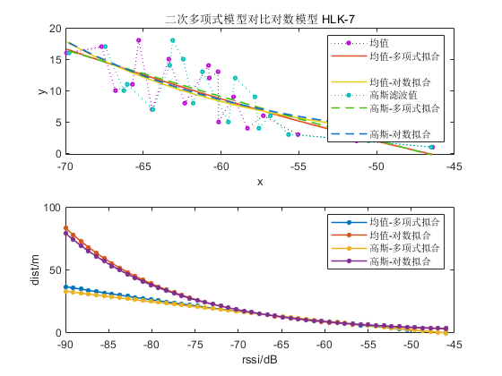
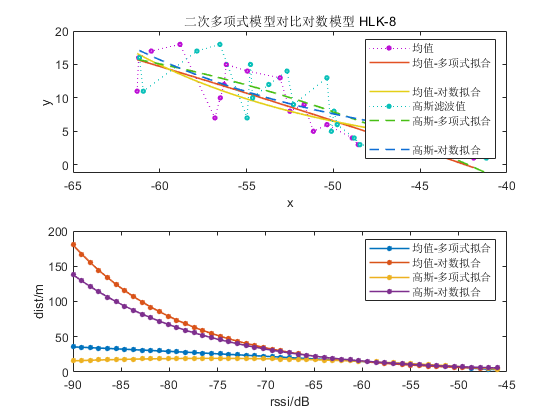

# Gaussian filter & Average 

## 1、对数衰减模型（Log-normal shadowing model）

  为了获取先验的对数衰减模型，需要在固定距离上对RSSI进行多次测量，以获取最优的距离$d$ 对应RSSI值$RSSI(d)$。由于各种环境因素的影响，原始RSSI测量值可能会有很大差异。为了提高定位精度，降低观测噪声的影响。因此将采集的原有RSSI值同均值滤波和Gaussian滤波效果进行对比。

## 2、Gaussian  distribution 

通过在该范围内选择RSSI，然后选择平均值作为从锚节点接收到的目标节点的RSSI测量值，即可获得RSSI的几何平均值。

## 3、高斯滤波实验结果

3.1 测试结果1

<file:D:\Code\BlueTooth\pos_bluetooth_matlab\attenuation_model\figure\gaussian-filter-HLK-1.fig>

图中，average表示对固定距离采集的RSSI所有数据取均值的结果。gaussian filter value 表示对固定距离采集的RSSI所有数据进行Gaussian滤波的结果。HLK-1表示蓝牙设备1。

3.2 测试结果2

<file:D:\Code\BlueTooth\pos_bluetooth_matlab\attenuation_model\figure\gaussian-filter-HLK-2.fig>

3.3 测试结果3

<file:D:\Code\BlueTooth\pos_bluetooth_matlab\attenuation_model\figure\gaussian-filter-HLK-3.fig>

3.4 测试结果4

<file:D:\Code\BlueTooth\pos_bluetooth_matlab\attenuation_model\figure\gaussian-filter-HLK-4.fig>

3.5 测试结果5

<file:D:\Code\BlueTooth\pos_bluetooth_matlab\attenuation_model\figure\gaussian-filter-HLK-5.fig>

3.6 测试结果6

<file:D:\Code\BlueTooth\pos_bluetooth_matlab\attenuation_model\figure\gaussian-filter-HLK-6.fig>

3.7 测试结果7

<file:D:\Code\BlueTooth\pos_bluetooth_matlab\attenuation_model\figure\gaussian-filter-HLK-7.fig>

3.8 测试结果8

<file:D:\Code\BlueTooth\pos_bluetooth_matlab\attenuation_model\figure\gaussian-filter-HLK-8.fig>

整体对比图

图中的：

gauss-gauss曲线，为对不同蓝牙信标固定距离对应的所有RSSI使用σ为1的高斯滤波，并对滤波后的数据再次使用σ为1的高斯滤波后结果。

图中的gauss-mean曲线，为对不同蓝牙信标固定距离对应的所有RSSI使用σ为1的高斯滤波，并对滤波后的数据取均值后的结果。

mean曲线为对不同蓝牙信标固定距离对应的所有RSSI取均值的结果。

​	<file:D:\Code\BlueTooth\pos_bluetooth_matlab\attenuation_model\doc\img\gaussian-mean-1.fig>

​	从上述实验结果看，对不同蓝牙信标固定距离下采集的RSSI分别进行高斯滤波（δ = 1）后取均值和对采集的RSSI直接进行均值得到的d-RSSI(距离-RSSI)曲线不同，从拟合对数模型角度看，没有较为明显的影响。此外不同的蓝牙信标d-RSSI的趋势不同。距离为1m时(参考RSSI值)，存在两个不同的RSSI区间，分别为-42dbm和-47dbm，分别有5个和2两个信标，其中最大的RSSI参考值为onepos_HLK_1，约为-39dbm。

​	蓝牙信标，在前半段(d<5m)能够基本符合对数曲线变化趋势，后半段(d>5m)呈现较为复杂的变化趋势，距离与RSSI的对应值并非呈现完全的反向变化关系，而是为波动下降，且波动幅值大。Max_RSSI(最大RSSI)值和Min_RSSI(最小RSSI)差值的平绝对值为7dbm。

​	不同蓝牙信标所采集的标准数据进行高斯滤波和均值滤波结果看，都随距离增大，RSSI值波动减小的趋势，且波动值gauss-gauss > gauss-mean > mean。

**波动大小和真实距离-RSSI关系？？？**

## 4、对RSSI进行kalman滤波

滤波结果&均值结果&原始数据对比如图：

<file:D:\Code\BlueTooth\pos_bluetooth_matlab\attenuation_model\figure\rssi-kalman-filter-1.fig>

从滤波结果看，将过程噪声协方差(矩阵)Q设置为0.01，观测噪声协方差（矩阵）R设置为100。滤波结果出现类似规律振荡。且最终收敛到几何均值附近。

## 5、拟合效果评估标准

### 5.1 SSE

SSE(和方差、误差平方和)：The sum of squares due to error.
$$
\begin{align}
& SSE = \sum_{i=1}^{n}(y_i - \hat{y}_i)^2
\end{align}
$$
$y_i$ 、$\hat{y}_i$ 分表表示原始数据和拟合模型的第$i$ 个值。SSE越接近于0，说明模型选择和拟合更好，数据预测也越成功。

类似预测结果还有：

MSE(均方差、方差)：Mean squared error。
RMSE(均方根、标准差)：Root mean squared error。

### 5.2 R-square(R^2)

R-square(确定系数)：Coefficient of determination。

$R^2$决定系数由总离差平方和（Total sum of squares,SST）和回归平方和（Sum of squares of the regression,SSR）共同决定。
$$
\begin{align}
& 预测数据与原始数据均值之差的平方和:\\
& SSR = \sum_{i=1}^N(\hat{y}_i - \bar{y})^2\\
& 原始数据和均值之差的平方和:\\
& SST = \sum_{i=1}^N(\hat{y} - \bar{y})^2\\
& R-square = \frac{SSR}{SST} = 1-\frac{SSE}{SST}\\
\end{align}
$$
其实“确定系数”是通过数据的变化来表征一个拟合的好坏。由上面的表达式可以知道“确定系数”的正常取值范围为[0 1]，越接近1，表明方程的变量对y的解释能力越强，这个模型对数据拟合的也较好。

## 6、拟合多项式和对数模型

6.1 测试结果1

蓝牙信标onepos_HLK_1,对单点RSSI取均值后分别使用多项式拟合和对数拟合结果对比。对单点RSSI高斯滤波(δ=1)后分别使用多项式拟合和对数拟合结果对比。

<file:D:\Code\BlueTooth\pos_bluetooth_matlab\attenuation_model\doc\img\ployfit-logafit-mean-gauss-1.fig>

**均值+多项式拟合模型**

     General model:
     ans(x) = p1*x^2 + p2*x + p3
     Coefficients (with 95% confidence bounds):
       p1 =     0.02405  (-0.01627, 0.06436)
       p2 =       1.632  (-2.529, 5.793)
       p3 =       27.04  (-79.71, 133.8)
**均值+多项式拟合结果**

           sse: 1.344712773774393e+02
       rsquare: 0.722453503864934
           dfe: 15
    adjrsquare: 0.685447304380259
          rmse: 2.994119540893887

**均值+对数拟合模型**

     General model:
     ans(x) = power(10,(a-x)/10/b)
     Coefficients (with 95% confidence bounds):
       a =       -31.9  (-42.91, -20.89)
       b =       2.345  (1.337, 3.353)
**均值+对数拟合结果**

           sse: 1.472946079511710e+02
       rsquare: 0.695986361297893
           dfe: 16
    adjrsquare: 0.676985508879011
          rmse: 3.034124749733964

**高斯+多项式拟合模型**

     General model:
     ans(x) = p1*x^2 + p2*x + p3
     Coefficients (with 95% confidence bounds):
       p1 =     0.01712  (-0.0222, 0.05643)
       p2 =      0.9649  (-3.092, 5.022)
       p3 =       11.78  (-92.28, 115.8)
**高斯+多项式拟合结果**

           sse: 1.499662557268544e+02
       rsquare: 0.690472124402777
           dfe: 15
    adjrsquare: 0.649201740989814
          rmse: 3.161921944291208

**高斯+对数拟合模型**

     General model:
     ans(x) = power(10,(a-x)/10/b)
     Coefficients (with 95% confidence bounds):
       a =      -29.08  (-41.87, -16.29)
       b =       2.587  (1.414, 3.761)
**高斯+对数拟合结果**

           sse: 1.615509011909902e+02
       rsquare: 0.666561607448937
           dfe: 16
    adjrsquare: 0.645721707914495
          rmse: 3.177566887484335

6.2 测试结果2

蓝牙信标onepos_HLK_2,对单点RSSI取均值后分别使用多项式拟合和对数拟合结果对比。对单点RSSI高斯滤波(δ=1)后分别使用多项式拟合和对数拟合结果对比。

<file:D:\Code\BlueTooth\pos_bluetooth_matlab\attenuation_model\doc\img\ployfit-logafit-mean-gauss-2.fig>

**均值+多项式拟合模型**

     General model:
     ans(x) = p1*x^2 + p2*x + p3
     Coefficients (with 95% confidence bounds):
       p1 =     0.01901  (-0.03079, 0.06881)
       p2 =       1.126  (-4.053, 6.305)
       p3 =       14.26  (-119.8, 148.3)
**均值+多项式拟合结果**

           sse: 1.806208579900162e+02
       rsquare: 0.627201531496355
           dfe: 15
    adjrsquare: 0.577495069029202
          rmse: 3.470070681220736

**均值+对数拟合模型**

     General model:
     ans(x) = power(10,(a-x)/10/b)
     Coefficients (with 95% confidence bounds):
       a =      -30.97  (-44.82, -17.13)
       b =       2.456  (1.172, 3.741)
**均值+对数拟合结果**

           sse: 1.961991261326948e+02
       rsquare: 0.595048243276172
           dfe: 16
    adjrsquare: 0.569738758480933
          rmse: 3.501777460561054

**高斯+多项式拟合模型**

     General model:
     ans(x) = p1*x^2 + p2*x + p3
     Coefficients (with 95% confidence bounds):
       p1 =     0.01974  (-0.03287, 0.07236)
       p2 =       1.216  (-4.281, 6.713)
       p3 =       16.82  (-126, 159.7)
**高斯+多项式拟合结果**

           sse: 1.796239328523189e+02
       rsquare: 0.629259168519466
           dfe: 15
    adjrsquare: 0.579827057655394
          rmse: 3.460481015237804

**高斯+对数拟合模型**

     General model:
     ans(x) = power(10,(a-x)/10/b)
     Coefficients (with 95% confidence bounds):
       a =      -31.81  (-45.37, -18.24)
       b =       2.393  (1.136, 3.65)
**高斯+对数拟合结果**

           sse: 1.916584547688650e+02
       rsquare: 0.604420113996151
           dfe: 16
    adjrsquare: 0.579696371120910
          rmse: 3.461019130697498

6.3 测试结果3

蓝牙信标onepos_HLK_3,对单点RSSI取均值后分别使用多项式拟合和对数拟合结果对比。对单点RSSI高斯滤波(δ=1)后分别使用多项式拟合和对数拟合结果对比。

<file:D:\Code\BlueTooth\pos_bluetooth_matlab\attenuation_model\doc\img\ployfit-logafit-mean-gauss-3.fig>

**均值+多项式拟合模型**

     General model:
     ans(x) = p1*x^2 + p2*x + p3
     Coefficients (with 95% confidence bounds):
       p1 =     0.02089  (-0.02939, 0.07117)
       p2 =       1.342  (-3.856, 6.54)
       p3 =       20.46  (-113.1, 154)
**均值+多项式拟合结果**

           sse: 1.812954431910398e+02
       rsquare: 0.625809198780104
           dfe: 15
    adjrsquare: 0.575917091950784
          rmse: 3.476544675306597

**均值+对数拟合模型**

     General model:
     ans(x) = power(10,(a-x)/10/b)
     Coefficients (with 95% confidence bounds):
       a =      -31.45  (-44.89, -18.01)
       b =       2.409  (1.165, 3.653)
**均值+对数拟合结果**

           sse: 1.907886325808392e+02
       rsquare: 0.606215412629847
           dfe: 16
    adjrsquare: 0.581603875919212
          rmse: 3.453156459864287

**高斯+多项式拟合模型**

     General model:
     ans(x) = p1*x^2 + p2*x + p3
     Coefficients (with 95% confidence bounds):
       p1 =   -0.001402  (-0.05635, 0.05355)
       p2 =     -0.8207  (-6.524, 4.883)
       p3 =      -30.55  (-177.4, 116.3)
**高斯+多项式拟合结果**

           sse: 2.360431149017451e+02
       rsquare: 0.512810908355531
           dfe: 15
    adjrsquare: 0.447852362802935
          rmse: 3.966888914516808

**高斯+对数拟合模型**

     General model:
     ans(x) = power(10,(a-x)/10/b)
     Coefficients (with 95% confidence bounds):
       a =      -23.77  (-46.53, -1.009)
       b =       3.162  (1.014, 5.31)
**高斯+对数拟合结果**

           sse: 2.522615090409423e+02
       rsquare: 0.479336410648210
           dfe: 16
    adjrsquare: 0.446794936313723
          rmse: 3.970685622793486

6.4 测试结果4

蓝牙信标onepos_HLK_4,对单点RSSI取均值后分别使用多项式拟合和对数拟合结果对比。对单点RSSI高斯滤波(δ=1)后分别使用多项式拟合和对数拟合结果对比。

<file:D:\Code\BlueTooth\pos_bluetooth_matlab\attenuation_model\doc\img\ployfit-logafit-mean-gauss-4.fig>

**均值+多项式拟合模型**

     General model:
     ans(x) = p1*x^2 + p2*x + p3
     Coefficients (with 95% confidence bounds):
       p1 =     0.03067  (-0.02963, 0.09096)
       p2 =       2.489  (-4.008, 8.985)
       p3 =       51.36  (-122.6, 225.3)
**均值+多项式拟合结果**

           sse: 2.080899763828962e+02
       rsquare: 0.570505724699905
           dfe: 15
    adjrsquare: 0.513239821326559
          rmse: 3.724602675748526

**均值+对数拟合模型**

     General model:
     ans(x) = power(10,(a-x)/10/b)
     Coefficients (with 95% confidence bounds):
       a =      -36.86  (-49.59, -24.12)
       b =       2.125  (0.9426, 3.307)
**均值+对数拟合结果**

           sse: 2.073908448263047e+02
       rsquare: 0.571948720688741
           dfe: 16
    adjrsquare: 0.545195515731788
          rmse: 3.600267740272110

**高斯+多项式拟合模型**

     General model:
     ans(x) = p1*x^2 + p2*x + p3
     Coefficients (with 95% confidence bounds):
       p1 =     0.01307  (-0.04437, 0.07052)
       p2 =      0.6658  (-5.528, 6.86)
       p3 =       5.425  (-160.5, 171.3)
**高斯+多项式拟合结果**

           sse: 2.181136337266479e+02
       rsquare: 0.549817061451707
           dfe: 15
    adjrsquare: 0.489792669645268
          rmse: 3.813254373249949

**高斯+对数拟合模型**

     General model:
     ans(x) = power(10,(a-x)/10/b)
     Coefficients (with 95% confidence bounds):
       a =      -31.62  (-48.42, -14.82)
       b =       2.595  (1.027, 4.164)
**高斯+对数拟合结果**

           sse: 2.224094709934138e+02
       rsquare: 0.540950524265400
           dfe: 16
    adjrsquare: 0.512259932031987
          rmse: 3.728349760562756

6.5 测试结果5

蓝牙信标onepos_HLK_5,对单点RSSI取均值后分别使用多项式拟合和对数拟合结果对比。对单点RSSI高斯滤波(δ=1)后分别使用多项式拟合和对数拟合结果对比。

<file:D:\Code\BlueTooth\pos_bluetooth_matlab\attenuation_model\doc\img\ployfit-logafit-mean-gauss-5.fig>

**均值+多项式拟合模型**

     General model:
     ans(x) = p1*x^2 + p2*x + p3
     Coefficients (with 95% confidence bounds):
       p1 =     0.01613  (-0.02013, 0.05238)
       p2 =      0.9965  (-2.942, 4.936)
       p3 =       13.79  (-92.25, 119.8)
**均值+多项式拟合结果**

           sse: 1.236680381652932e+02
       rsquare: 0.744751211217145
           dfe: 15
    adjrsquare: 0.710718039379431
          rmse: 2.871329984116457

**均值+对数拟合模型**

     General model:
     ans(x) = power(10,(a-x)/10/b)
     Coefficients (with 95% confidence bounds):
       a =      -32.72  (-44.44, -20.99)
       b =       2.559  (1.489, 3.629)
**均值+对数拟合结果**

           sse: 1.320148713548237e+02
       rsquare: 0.727523485335761
           dfe: 16
    adjrsquare: 0.710493703169246
          rmse: 2.872443116873941

**高斯+多项式拟合模型**

     General model:
     ans(x) = p1*x^2 + p2*x + p3
     Coefficients (with 95% confidence bounds):
       p1 =    0.006845  (-0.03402, 0.04771)
       p2 =      0.0544  (-4.385, 4.494)
       p3 =      -9.349  (-128.7, 110)
**高斯+多项式拟合结果**

           sse: 1.598246773917393e+02
       rsquare: 0.670124504867411
           dfe: 15
    adjrsquare: 0.626141105516399
          rmse: 3.264196454379335

**高斯+对数拟合模型**

     General model:
     ans(x) = power(10,(a-x)/10/b)
     Coefficients (with 95% confidence bounds):
       a =      -29.34  (-45.11, -13.57)
       b =        2.88  (1.427, 4.333)
**高斯+对数拟合结果**

           sse: 1.695630102369220e+02
       rsquare: 0.650024746673020
           dfe: 16
    adjrsquare: 0.628151293340083
          rmse: 3.255409058752467

6.6 测试结果6

蓝牙信标onepos_HLK_6,对单点RSSI取均值后分别使用多项式拟合和对数拟合结果对比。对单点RSSI高斯滤波(δ=1)后分别使用多项式拟合和对数拟合结果对比。

<file:D:\Code\BlueTooth\pos_bluetooth_matlab\attenuation_model\doc\img\ployfit-logafit-mean-gauss-6.fig>

**均值+多项式拟合模型**

     General model:
     ans(x) = p1*x^2 + p2*x + p3
     Coefficients (with 95% confidence bounds):
       p1 =      0.0025  (-0.03514, 0.04014)
       p2 =     -0.4277  (-4.904, 4.048)
       p3 =      -26.17  (-158.5, 106.2)
**均值+多项式拟合结果**

           sse: 1.684188623165111e+02
       rsquare: 0.652386249088728
           dfe: 15
    adjrsquare: 0.606037748967225
          rmse: 3.350809477489593

**均值+对数拟合模型**

     General model:
     ans(x) = power(10,(a-x)/10/b)
     Coefficients (with 95% confidence bounds):
       a =      -31.23  (-49.19, -13.26)
       b =       3.165  (1.496, 4.835)
**均值+对数拟合结果**

           sse: 1.962219745818731e+02
       rsquare: 0.595001084454338
           dfe: 16
    adjrsquare: 0.569688652232734
          rmse: 3.501981355085585

**高斯+多项式拟合模型**

     General model:
     ans(x) = p1*x^2 + p2*x + p3
     Coefficients (with 95% confidence bounds):
       p1 =   -0.002234  (-0.03517, 0.0307)
       p2 =       -0.92  (-4.835, 2.995)
       p3 =      -38.15  (-153.9, 77.61)
**高斯+多项式拟合结果**

           sse: 1.955875269094763e+02
       rsquare: 0.596310573974249
           dfe: 15
    adjrsquare: 0.542485317170816
          rmse: 3.610978878452733

**高斯+对数拟合模型**

     General model:
     ans(x) = power(10,(a-x)/10/b)
     Coefficients (with 95% confidence bounds):
       a =      -24.94  (-48.01, -1.87)
       b =       3.763  (1.603, 5.924)
**高斯+对数拟合结果**

           sse: 2.291374854945760e+02
       rsquare: 0.527064013427088
           dfe: 16
    adjrsquare: 0.497505514266281
          rmse: 3.784321979352576

6.7 测试结果7

蓝牙信标onepos_HLK_7,对单点RSSI取均值后分别使用多项式拟合和对数拟合结果对比。对单点RSSI高斯滤波(δ=1)后分别使用多项式拟合和对数拟合结果对比。

<file:D:\Code\BlueTooth\pos_bluetooth_matlab\attenuation_model\doc\img\ployfit-logafit-mean-gauss-7.fig>

**均值+多项式拟合模型**

     General model:
     ans(x) = p1*x^2 + p2*x + p3
     Coefficients (with 95% confidence bounds):
       p1 =    0.006227  (-0.03388, 0.04633)
       p2 =     0.01118  (-4.702, 4.724)
       p3 =      -13.06  (-150.7, 124.6)
**均值+多项式拟合结果**

           sse: 1.807243727206145e+02
       rsquare: 0.626987878801621
           dfe: 15
    adjrsquare: 0.577252929308504
          rmse: 3.471064896354955

**均值+对数拟合模型**

     General model:
     ans(x) = power(10,(a-x)/10/b)
     Coefficients (with 95% confidence bounds):
       a =      -32.55  (-49.76, -15.35)
       b =       2.992  (1.394, 4.59)
**均值+对数拟合结果**

           sse: 1.989737022747707e+02
       rsquare: 0.589321563932362
           dfe: 16
    adjrsquare: 0.563654161678135
          rmse: 3.526450962678081

**高斯+多项式拟合模型**

     General model:
     ans(x) = p1*x^2 + p2*x + p3
     Coefficients (with 95% confidence bounds):
       p1 =     0.00227  (-0.03941, 0.04395)
       p2 =     -0.4466  (-5.331, 4.438)
       p3 =      -25.91  (-168.2, 116.4)
**高斯+多项式拟合结果**

           sse: 1.880556023346110e+02
       rsquare: 0.611856341930627
           dfe: 15
    adjrsquare: 0.560103854188044
          rmse: 3.540768300191462

**高斯+对数拟合模型**

     General model:
     ans(x) = power(10,(a-x)/10/b)
     Coefficients (with 95% confidence bounds):
       a =      -31.06  (-49.68, -12.43)
       b =       3.107  (1.372, 4.843)
**高斯+对数拟合结果**

           sse: 2.099917966039608e+02
       rsquare: 0.566580399166231
           dfe: 16
    adjrsquare: 0.539491674114121
          rmse: 3.622773424842844

6.8 测试结果8

蓝牙信标onepos_HLK_8,对单点RSSI取均值后分别使用多项式拟合和对数拟合结果对比。对单点RSSI高斯滤波(δ=1)后分别使用多项式拟合和对数拟合结果对比。

<file:D:\Code\BlueTooth\pos_bluetooth_matlab\attenuation_model\doc\img\ployfit-logafit-mean-gauss-8.fig>

**均值+多项式拟合模型**

     General model:
     ans(x) = p1*x^2 + p2*x + p3
     Coefficients (with 95% confidence bounds):
       p1 =   -0.002882  (-0.0479, 0.04213)
       p2 =       -1.13  (-5.86, 3.6)
       p3 =      -42.74  (-166.1, 80.64)
**均值+多项式拟合结果**

           sse: 1.307763577450801e+02
       rsquare: 0.730079756976099
           dfe: 15
    adjrsquare: 0.694090391239579
          rmse: 2.952697724060492

**均值+对数拟合模型**

     General model:
     ans(x) = power(10,(a-x)/10/b)
     Coefficients (with 95% confidence bounds):
       a =      -27.45  (-41.22, -13.68)
       b =       2.773  (1.507, 4.039)
**均值+对数拟合结果**

           sse: 1.609551261999023e+02
       rsquare: 0.667791277193184
           dfe: 16
    adjrsquare: 0.647028232017758
          rmse: 3.171702285444505

**高斯+多项式拟合模型**

     General model:
     ans(x) = p1*x^2 + p2*x + p3
     Coefficients (with 95% confidence bounds):
       p1 =    -0.01725  (-0.06706, 0.03255)
       p2 =      -2.613  (-7.792, 2.566)
       p3 =       -79.6  (-213.6, 54.37)
**高斯+多项式拟合结果**

           sse: 1.703776160356113e+02
       rsquare: 0.648343413755188
           dfe: 15
    adjrsquare: 0.601455868922547
          rmse: 3.370238528013621

**高斯+对数拟合模型**

     General model:
     ans(x) = power(10,(a-x)/10/b)
     Coefficients (with 95% confidence bounds):
       a =         -22  (-40.77, -3.226)
       b =       3.178  (1.425, 4.931)
**高斯+对数拟合结果**

           sse: 2.202323397944051e+02
       rsquare: 0.545444087111651
           dfe: 16
    adjrsquare: 0.517034342556129
          rmse: 3.710056770071089

​	RSSI均值拟合，对比多项式模型和对数模型，从拟合结果看，有以下几点差异：1、多项式拟合模型有三个参数需要调整，而对数拟合模型有两个参数需要调整；2、RSSI在较大的时候，多项式拟合模型和对数拟合模型曲线走势较为接近，当RSSI较小时，对数拟合模型的变化趋势大，远远偏离正常变化，而多项式拟合模型则变化趋势较小，符合客观变化情况；

3、并且拟合效果参数多项式拟合比对数拟合更好。

综合上述实验结果，选用多项式模型会优于对数模型。

## 7、Reference

1.[Microsoft PowerPoint - Image Filtering-6.ppt [Compatibility Mode\] (auckland.ac.nz)](https://www.cs.auckland.ac.nz/courses/compsci373s1c/PatricesLectures/Gaussian Filtering_1up.pdf)

2.[MATLAB拟合中SSE，MSE，RMSE，R-square,Adjusted R-quuare含义_qhsong的博客-CSDN博客](https://blog.csdn.net/qq_25614747/article/details/55194007?utm_medium=distribute.pc_relevant.none-task-blog-baidujs_title-0&spm=1001.2101.3001.4242)

