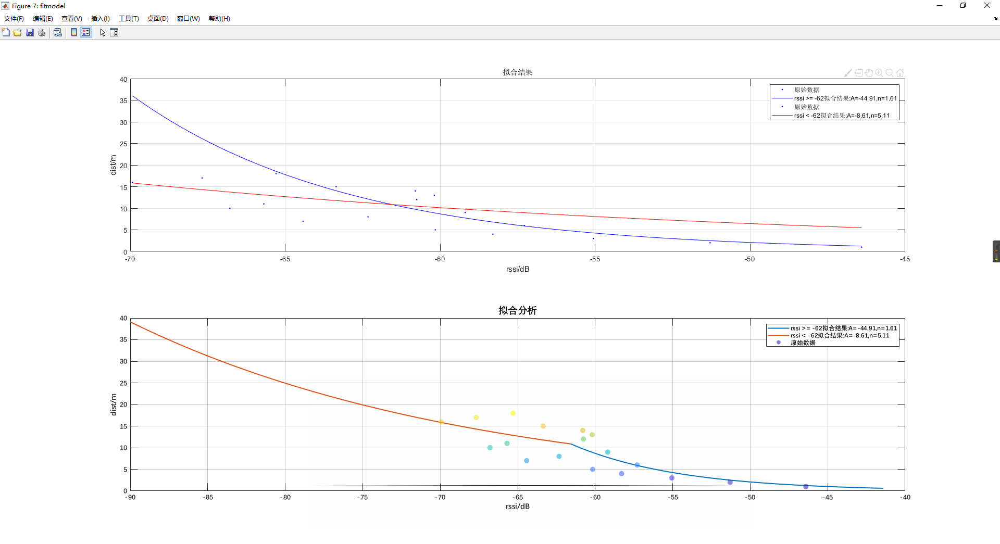
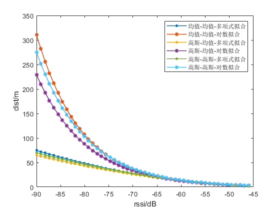

# 一、分段拟合

## 1、对数路径损耗模型

​	现有室内蓝牙定位（**Indoor BlueTooth Location**）方案是基于接收信号强度指示RSSI的多点定位方法 。**RSSI**测距的基本原理：无线信号传输中，信号强度随距离变化呈一定规律的衰减（**对数路径损耗模型**），根据采样信号构建路径衰减数学模型，然后将测量过程中的**RSSI**转换成距离最终计算测量点的位置。

对数路径损耗模型：
$$
\begin{align}
& \bold{Pl(d) = Pl(d_0) + 10nlg(d/d_0) + X_{\delta}}\\
\end{align}
$$
$Pl(d)$ ：未知节点在距离为d时对应的接收信号功率(dBm)；

$X_{\delta}$ ： 标准偏差为$\delta$的正态随机变量，$\delta $的取值与信号跳变过程相关；

不考虑信号跳变量$X_{\delta}$，通过上述公式可得：
$$
\begin{align}
&\bold{p(d)=A-10blg(d)} \\
\end{align}
$$

$$
\begin{align}
&\bold{d_1 = {\frac{A - RSSI}{10*b}}}\\
& \bold{d = 10^{d_1}}
\end{align}
$$


$A(A < 0)$：距离1m时，设备接收到无线信号的RSSI值；

$b(b>0)$：衰减系数；

$d(d>0)$：解算距离(m)；

$RSSI(RSSI<0)$ ：rssi观测值(db)；

## 2、分段拟合

​	从实验中发现，如果采用单一对数路径损耗模型存在以下不足：（1）以全局最优为拟合方式和拟合目标，得到的对数路径损耗模型中${n}$值偏小，当${RSSI}$ 值较小的情况下，解算出来的距离会偏大很多。（2）当${n}$值偏大的情况下，${RSSI}$较大的情况下，误差偏大。

​	为了解决上述问题，依据$RSSI$值将曲线分为两部分单独进行拟合，$pd_1(RSSI < RSSI_c)$ 和 ${pd_2(RSSI \geq const(RSSI_c)  )}$ 两个函数。拟合完成之后，将${pd_1 =pd_2}$ 对应的${RSSI_i}$ 作为后续解算分段的依据。

```c
todo:figure
```

## 3、分段拟合结果

​	在较为理想的情况下，测试RSSI和距离对应数据，并根据测试结果对8个锚节点（anchor）特征分别进行分段拟合。拟合结果如下：

### 3.1 one_pos_HLK_1


<file:D:\Code\BlueTooth\pos_bluetooth_matlab\attenuation_model\figure\one_pos_HLK_1分段拟合结果-1.fig>

rssi >= -50拟合结果:A=-46.44,n=0.36

```
 General model:
     fitresult_1(x) = power(10,(a-x)/10/b)
     Coefficients (with 95% confidence bounds):
       a =      -46.44  (-60.94, -31.94)
       b =      0.3551  (-1.296, 2.006)
```

rssi < -50拟合结果:A=-31.03,n=2.42

```
     General model:
     fitresult_2(x) = power(10,(a-x)/10/b)
     Coefficients (with 95% confidence bounds):
       a =      -31.03  (-45.54, -16.52)
       b =       2.424  (1.105, 3.743)
```

分段曲线交点RSSI:-49.08

```matlab
 AP_1 =  struct('Name','onepos_HLK_1',...
     'param_less_rssi',[-31.03,2.424],...
     'param_more_rssi',[-46.44,0.3551],...
     'piecewise_rssi', -49.08);
```

___________________

 ### 3.2 one_pos_HLK_2


<file:D:\Code\BlueTooth\pos_bluetooth_matlab\attenuation_model\figure\one_pos_HLK_1分段拟合结果-2.fig>

rssi >= -52拟合结果:A=-44.25,n=0.86

```
     General model:
     fitresult_1(x) = power(10,(a-x)/10/b)
     Coefficients (with 95% confidence bounds):
       a =      -44.25  (-56.21, -32.28)
       b =      0.8552  (-0.6993, 2.41)
```

rssi < -52拟合结果:A=-24.65,n=3.02

```
     General model:
     fitresult_2(x) = power(10,(a-x)/10/b)
     Coefficients (with 95% confidence bounds):
       a =      -24.65  (-56.66, 7.355)
       b =       3.018  (0.09569, 5.94)
```

分段曲线交点RSSI:-52.00

```matlab
AP_2 =  struct('Name','onepos_HLK_2',...
    'param_less_rssi',[-24.65,3.018],...
    'param_more_rssi',[ -44.25 ,0.8552],...
    'piecewise_rssi', -52);
```


___________________

 ### 3.3 one_pos_HLK_3


<file:D:\Code\BlueTooth\pos_bluetooth_matlab\attenuation_model\figure\one_pos_HLK_1分段拟合结果-3.fig>

rssi >= -51拟合结果:A=-44.78,n=0.75

```
General model:
     fitresult_1(x) = power(10,(a-x)/10/b)
     Coefficients (with 95% confidence bounds):
       a =      -44.78  (-51.35, -38.21)
       b =      0.7517  (-0.07243, 1.576)
```

​     

rssi < -51拟合结果:A=-26.35,n=2.86

```
     General model:
     fitresult_2(x) = power(10,(a-x)/10/b)
     Coefficients (with 95% confidence bounds):
       a =      -26.35  (-56.6, 3.894)
       b =       2.865  (0.1043, 5.625)
```

分段曲线交点RSSI:-51.33

```matlab
AP_3 =  struct('Name','onepos_HLK_3',...
    'param_less_rssi',[-26.35,2.86],...
    'param_more_rssi',[-44.78,0.75],...
    'piecewise_rssi', -51.33);
```


___________________

### 3.4 one_pos_HLK_4


<file:D:\Code\BlueTooth\pos_bluetooth_matlab\attenuation_model\figure\one_pos_HLK_1分段拟合结果-4.fig>

rssi >= -53拟合结果:A=-46.49,n=0.80

```
General model:
     fitresult_1(x) = power(10,(a-x)/10/b)
     Coefficients (with 95% confidence bounds):
       a =      -46.49  (-55.23, -37.75)
       b =      0.7952  (-0.2551, 1.845)
```

​     

rssi < -53拟合结果:A=-36.49,n=2.16

```
     General model:
     fitresult_2(x) = power(10,(a-x)/10/b)
     Coefficients (with 95% confidence bounds):
       a =      -36.49  (-55.77, -17.2)
       b =       2.161  (0.3905, 3.931)
```


分段曲线交点RSSI:-52.32

```matlab
AP_4 =  struct('Name','onepos_HLK_4',...
    'param_less_rssi',[-36.49,2.16],...
    'param_more_rssi',[-46.49,0.80],...
    'piecewise_rssi', -52.32);

```


___________________

 ### 3.5 one_pos_HLK_5


<file:D:\Code\BlueTooth\pos_bluetooth_matlab\attenuation_model\figure\one_pos_HLK_1分段拟合结果-5.fig>

rssi >= -53拟合结果:A=-44.01,n=1.02

```
     General model:
     fitresult_1(x) = power(10,(a-x)/10/b)
     Coefficients (with 95% confidence bounds):
       a =      -44.01  (-48.05, -39.98)
       b =       1.015  (0.5313, 1.499)
```

rssi < -53拟合结果:A=-30.28,n=2.78

```
     General model:
     fitresult_2(x) = power(10,(a-x)/10/b)
     Coefficients (with 95% confidence bounds):
       a =      -30.28  (-49.54, -11.03)
       b =       2.777  (1.034, 4.52)
```

分段曲线交点RSSI:-51.93

```matlab
AP_5 =  struct('Name','onepos_HLK_5',...
    'param_less_rssi',[-30.28,2.78],...
    'param_more_rssi',[-44.01,1.02],...
    'piecewise_rssi', -51.93);

```


___________________

 ### 3.6 one_pos_HLK_6


<file:D:\Code\BlueTooth\pos_bluetooth_matlab\attenuation_model\figure\one_pos_HLK_1分段拟合结果-6.fig>

rssi >= -59拟合结果:A=-45.45,n=1.71

```
     General model:
     fitresult_1(x) = power(10,(a-x)/10/b)
     Coefficients (with 95% confidence bounds):
       a =      -45.45  (-68.74, -22.15)
       b =       1.707  (-1.589, 5.003)
```


rssi < -59拟合结果:A=-6.33,n=5.36

```
     General model:
     fitresult_2(x) = power(10,(a-x)/10/b)
     Coefficients (with 95% confidence bounds):
       a =      -6.327  (-87.73, 75.08)
       b =       5.365  (-2.017, 12.75)
```

分段曲线交点RSSI:-63.70

```matlab
AP_6 =  struct('Name','onepos_HLK_6',...
    'param_less_rssi',[-6.33,5.36],...
    'param_more_rssi',[-45.45,1.71],...
    'piecewise_rssi', -63.70);
```


___________________

 ### 3.7 one_pos_HLK_7



<file:D:\Code\BlueTooth\pos_bluetooth_matlab\attenuation_model\figure\one_pos_HLK_1分段拟合结果-7.fig>

rssi >= -62拟合结果:A=-44.91,n=1.61

```
     General model:
     fitresult_1(x) = power(10,(a-x)/10/b)
     Coefficients (with 95% confidence bounds):
       a =      -44.91  (-59.68, -30.15)
       b =       1.607  (0.06736, 3.147)
```

rssi < -62拟合结果:A=-8.61,n=5.11

```
General model:
     fitresult_2(x) = power(10,(a-x)/10/b)
     Coefficients (with 95% confidence bounds):
       a =      -8.611  (-196.9, 179.7)
       b =       5.111  (-11.49, 21.71)
```

​     

分段曲线交点RSSI:-61.56

```matlab
AP_7 =  struct('Name','onepos_HLK_7',...
    'param_less_rssi',[-8.61,5.11],...
    'param_more_rssi',[-44.91,1.61],...
    'piecewise_rssi', -61.56);
```


___________________

 ### 3.8 one_pos_HLK_8


<file:D:\Code\BlueTooth\pos_bluetooth_matlab\attenuation_model\figure\one_pos_HLK_1分段拟合结果-7.fig>

rssi >= -53拟合结果:A=-42.33,n=1.09

```
     General model:
     fitresult_1(x) = power(10,(a-x)/10/b)
     Coefficients (with 95% confidence bounds):
       a =      -42.33  (-47.12, -37.55)
       b =       1.091  (0.509, 1.673)
```

rssi < -53拟合结果:A=35.78,n=8.31

```
     General model:
     fitresult_2(x) = power(10,(a-x)/10/b)
     Coefficients (with 95% confidence bounds):
       a =       35.78  (-205.9, 277.5)
       b =       8.315  (-13.12, 29.74)
```

分段曲线交点RSSI:-54.13

```matlab
AP_8 =  struct('Name','onepos_HLK_8',...    'param_less_rssi',[35.78,8.315],...    'param_more_rssi',[-42.33,1.09],...    'piecewise_rssi', -54.13);
```


___________________

## 4、偏置拟合结果

​	蓝牙anchor点发送的rssi-reference作为参考值${RSSI_r}$，对比理想测试条件下1m处的RSSI值${RSSI_1}$，将上述两值的差作为偏置量，将理想测试条件下的RSSI值叠加上偏置量，将带有偏置量的数据进行拟合获取拟合结果如下。

​	从拟合的结果看，采用分段对数模型错位拟合目标函数，以标准测试结果偏置后5m处对应的RSSI 作为拟合的分段，拟合出的两条曲线可能会出现在有效测试距离内(距离<18米的rssi中无法找到两条曲线交点的情况)。

```matlab
## AP:1 拟合结果
 ### 分段RSSI:-60.7
rssi >= -62拟合结果:A=-44.16,n=2.47
     General model:
     fitresult_1(x) = power(10,(a-x)/10/b)
     Coefficients (with 95% confidence bounds):
       a =      -44.16  (-87.08, -1.228)
       b =       2.474  (-3.97, 8.917)
rssi < -62拟合结果:A=-21.28,n=4.17
     General model:
     fitresult_2(x) = power(10,(a-x)/10/b)
     Coefficients (with 95% confidence bounds):
       a =      -21.28  (-80.41, 37.85)
       b =       4.168  (-1.096, 9.432)
分段曲线交点RSSI:-77.55
___________________
## AP:2 拟合结果
 ### 分段RSSI:-60.1
rssi >= -62拟合结果:A=-48.24,n=1.70
     General model:
     fitresult_1(x) = power(10,(a-x)/10/b)
     Coefficients (with 95% confidence bounds):
       a =      -48.24  (-72.1, -24.38)
       b =       1.704  (-1.599, 5.006)
rssi < -62拟合结果:A=-27.89,n=3.55
     General model:
     fitresult_2(x) = power(10,(a-x)/10/b)
     Coefficients (with 95% confidence bounds):
       a =      -27.89  (-75.88, 20.1)
       b =       3.554  (-0.795, 7.903)
分段曲线交点RSSI:-66.98
___________________
## AP:3 拟合结果
 ### 分段RSSI:-59.5
rssi >= -66拟合结果:A=-40.17,n=2.61
     General model:
     fitresult_1(x) = power(10,(a-x)/10/b)
     Coefficients (with 95% confidence bounds):
       a =      -40.17  (-74.86, -5.49)
       b =       2.615  (-1.318, 6.547)
rssi < -66拟合结果:A=-8.62,n=5.16
     General model:
     fitresult_2(x) = power(10,(a-x)/10/b)
     Coefficients (with 95% confidence bounds):
       a =      -8.624  (-160.6, 143.4)
       b =       5.163  (-7.99, 18.32)
分段曲线交点RSSI:-72.55
___________________
## AP:4 拟合结果
 ### 分段RSSI:-62.4
rssi >= -64拟合结果:A=-47.02,n=1.67
     General model:
     fitresult_1(x) = power(10,(a-x)/10/b)
     Coefficients (with 95% confidence bounds):
       a =      -47.02  (-66.95, -27.08)
       b =       1.668  (-0.4423, 3.778)
rssi < -64拟合结果:A=-51.36,n=1.47
     General model:
     fitresult_2(x) = power(10,(a-x)/10/b)
     Coefficients (with 95% confidence bounds):
       a =      -51.36  (-69.55, -33.17)
       b =       1.468  (-0.1266, 3.064)
分段曲线交点RSSI:-83.33
___________________
## AP:5 拟合结果
 ### 分段RSSI:-61.6
rssi >= -63拟合结果:A=-46.42,n=1.97
     General model:
     fitresult_1(x) = power(10,(a-x)/10/b)
     Coefficients (with 95% confidence bounds):
       a =      -46.42  (-64.93, -27.91)
       b =       1.971  (-0.421, 4.364)
rssi < -63拟合结果:A=-9.70,n=5.25
     General model:
     fitresult_2(x) = power(10,(a-x)/10/b)
     Coefficients (with 95% confidence bounds):
       a =        -9.7  (-115.5, 96.08)
       b =       5.249  (-4.101, 14.6)
分段曲线交点RSSI:-68.51
___________________
## AP:6 拟合结果
 ### 分段RSSI:-60.2
rssi >= -64拟合结果:A=-45.53,n=2.14
     General model:
     fitresult_1(x) = power(10,(a-x)/10/b)
     Coefficients (with 95% confidence bounds):
       a =      -45.53  (-67.13, -23.93)
       b =       2.143  (-0.6747, 4.961)
rssi < -64拟合结果:A=57.80,n=11.22
     General model:
     fitresult_2(x) = power(10,(a-x)/10/b)
     Coefficients (with 95% confidence bounds):
       a =        57.8  (-342.3, 457.9)
       b =       11.22  (-24.3, 46.74)
分段曲线交点RSSI:-69.92
___________________
## AP:7 拟合结果
 ### 分段RSSI:-62.0
rssi >= -64拟合结果:A=-48.56,n=1.82
     General model:
     fitresult_1(x) = power(10,(a-x)/10/b)
     Coefficients (with 95% confidence bounds):
       a =      -48.56  (-66.02, -31.11)
       b =       1.823  (-0.5158, 4.161)
rssi < -64拟合结果:A=24.84,n=8.39
     General model:
     fitresult_2(x) = power(10,(a-x)/10/b)
     Coefficients (with 95% confidence bounds):
       a =       24.84  (-190.5, 240.2)
       b =       8.388  (-10.97, 27.74)
分段曲线交点RSSI:-68.94
___________________
## AP:8 拟合结果
 ### 分段RSSI:-57.1
rssi >= -59拟合结果:A=-49.17,n=1.35
     General model:
     fitresult_1(x) = power(10,(a-x)/10/b)
     Coefficients (with 95% confidence bounds):
       a =      -49.17  (-55.43, -42.9)
       b =       1.348  (0.4052, 2.292)
rssi < -59拟合结果:A=-8.04,n=5.20
     General model:
     fitresult_2(x) = power(10,(a-x)/10/b)
     Coefficients (with 95% confidence bounds):
       a =      -8.036  (-77.16, 61.09)
       b =       5.196  (-1.025, 11.42)
分段曲线交点RSSI:-63.58
```

## 5、结论

​	使用分段拟合方法对不同的蓝牙信标进行拟合，能够解决存在的以下问题：

1. 不同蓝牙信标测试出来的标准距离-RSSI曲线特性差异较大的问题；
2. 使用单个对数模型在某些拟合情况下，RSSI较小(<-80dbm)的时候通过模型计算出来的距离出现严重偏差。

  但是会存在以下问题：

1. 需要拟合的参数较多，且在一些特殊情况下，分段函数曲线无法相交于一点的；
2. 分段点的选取没有较好的参考性，且分段依据为RSSI值；
3. 距离-RSSI标准测试是在较为理想的情况下进行的，在实际的使用中，越是理想的拟合模型反而不能有效的反应距离和RSSI的对应关系；

# 二、均值对数模型分析


## 1、多模型分段拟合

多模型分段存在以下不足：

1. 根据不同AP所采集的标准数据分段拟合对数模型；
2. 标准数据采集的过程比较理想化，没有考虑实际使用过程中存在的影响因素；
3. 不同的AP标准数据不满足基本的距离-RSSI衰减变化趋势；
4. 将实际使用过程中的影响RSSI因素考虑进来，对数模型基本不能准确反映距离值；

标准DIST-RSSI测试结果-不同AP对比如图：


<file:D:\Code\BlueTooth\pos_bluetooth_matlab\attenuation_model\figure\8个AP统计结果-距离-rssi均值-对比分析.fig>

依据参考RSSI值对上述数据进行y轴平移后的标准DIST-RSSI测试结果-不同AP如图：


<file:D:\Code\BlueTooth\pos_bluetooth_matlab\attenuation_model\figure\8个AP统计结果-距离-rssi均值-delta-1.fig>

## 2、均值对数模型

为了解决上述部分问题，提出如下解决方案：

1. 计算所有ap在不同距离下采集的RSSI的均值；
2. 根据上述结果，引入环境因子${\Delta_{env}}$ 。

所有ap均值同原有单个ap均值DIST-RSSI对比如图：


<file:D:\Code\BlueTooth\pos_bluetooth_matlab\attenuation_model\figure\所有ap固定距离rssi均值同单个ap均值对比.fig>

## 3、引入环境因子

引入环境因子后的模型：
$$
\begin{align}
&\bold{p(d)=A-10blg(d)+\Delta_{env}} \\
\end{align}
$$

$$
\begin{align}
&\bold{d_1 = {\frac{A - RSSI+\Delta_{env}}{10*b}}}\\
& \bold{d = 10^{d_1}}
\end{align}
$$


$A(A < 0)$：距离1m时，设备接收到无线信号的RSSI值；

$b(b>0)$：衰减系数；

$d(d>0)$：解算距离(m)；

$RSSI(RSSI<0)$ ：rssi观测值(db)；

室内环境因子参考


引入环境因子后的模型拟合结果如图：


## 4、结论


$$
\begin{align}
& \bold{d(rssi) =d_0*10^\frac{ -51.4600-rssi}{10*2.149}}\\
\end{align}
$$
从拟合结果看，将环境因子${\Delta_{env}}$ 设置为-15，拟合出来的结果较好，且距离为1时的rssi值同ap参考值基本一致；

上述方案具备以下优点：

- 相比较于分段拟合模型更简单；
- **方便后期的模型自适应拟合**；
- 能较好地应对实际使用情况；


# 三、高斯滤波和均值滤波

refere to

<file:D:\Code\BlueTooth\pos_bluetooth_matlab\attenuation_model\doc\Gaussian-filter and average.md>

# 四、对数拟合和多项式(二次)拟合

## 1、拟合效果评估标准

### SSE

SSE(和方差、误差平方和)：The sum of squares due to error.
$$
\begin{align}
& SSE = \sum_{i=1}^{n}(y_i - \hat{y}_i)^2
\end{align}
$$
$y_i$ 、$\hat{y}_i$ 分表表示原始数据和拟合模型的第$i$ 个值。SSE越接近于0，说明模型选择和拟合更好，数据预测也越成功。

类似预测结果还有：

MSE(均方差、方差)：Mean squared error。
RMSE(均方根、标准差)：Root mean squared error。

### R-square(R^2)

R-square(确定系数)：Coefficient of determination。

$R^2$决定系数由总离差平方和（Total sum of squares,SST）和回归平方和（Sum of squares of the regression,SSR）共同决定。
$$
\begin{align}
& 预测数据与原始数据均值之差的平方和:\\
& SSR = \sum_{i=1}^N(\hat{y}_i - \bar{y})^2\\
& 原始数据和均值之差的平方和:\\
& SST = \sum_{i=1}^N(\hat{y} - \bar{y})^2\\
& R-square = \frac{SSR}{SST} = 1-\frac{SSE}{SST}\\
\end{align}
$$
其实“确定系数”是通过数据的变化来表征一个拟合的好坏。由上面的表达式可以知道“确定系数”的正常取值范围为[0 1]，越接近1，表明方程的变量对y的解释能力越强，这个模型对数据拟合的也较好。

## 2、拟合多项式和对数模型——分别拟合

6.1 测试结果1

蓝牙信标onepos_HLK_1,对单点RSSI取均值后分别使用多项式拟合和对数拟合结果对比。对单点RSSI高斯滤波(δ=1)后分别使用多项式拟合和对数拟合结果对比。


<file:D:\Code\BlueTooth\pos_bluetooth_matlab\attenuation_model\doc\img\ployfit-logafit-mean-gauss-1.fig>

**均值+多项式拟合模型**

     General model:
     ans(x) = p1*x^2 + p2*x + p3
     Coefficients (with 95% confidence bounds):
       p1 =     0.02405  (-0.01627, 0.06436)
       p2 =       1.632  (-2.529, 5.793)
       p3 =       27.04  (-79.71, 133.8)

**均值+多项式拟合结果**

           sse: 1.344712773774393e+02
       rsquare: 0.722453503864934
           dfe: 15
    adjrsquare: 0.685447304380259
          rmse: 2.994119540893887

**均值+对数拟合模型**

     General model:
     ans(x) = power(10,(a-x)/10/b)
     Coefficients (with 95% confidence bounds):
       a =       -31.9  (-42.91, -20.89)
       b =       2.345  (1.337, 3.353)

**均值+对数拟合结果**

           sse: 1.472946079511710e+02
       rsquare: 0.695986361297893
           dfe: 16
    adjrsquare: 0.676985508879011
          rmse: 3.034124749733964

**高斯+多项式拟合模型**

     General model:
     ans(x) = p1*x^2 + p2*x + p3
     Coefficients (with 95% confidence bounds):
       p1 =     0.01712  (-0.0222, 0.05643)
       p2 =      0.9649  (-3.092, 5.022)
       p3 =       11.78  (-92.28, 115.8)

**高斯+多项式拟合结果**

           sse: 1.499662557268544e+02
       rsquare: 0.690472124402777
           dfe: 15
    adjrsquare: 0.649201740989814
          rmse: 3.161921944291208

**高斯+对数拟合模型**

     General model:
     ans(x) = power(10,(a-x)/10/b)
     Coefficients (with 95% confidence bounds):
       a =      -29.08  (-41.87, -16.29)
       b =       2.587  (1.414, 3.761)

**高斯+对数拟合结果**

           sse: 1.615509011909902e+02
       rsquare: 0.666561607448937
           dfe: 16
    adjrsquare: 0.645721707914495
          rmse: 3.177566887484335

6.2 测试结果2

蓝牙信标onepos_HLK_2,对单点RSSI取均值后分别使用多项式拟合和对数拟合结果对比。对单点RSSI高斯滤波(δ=1)后分别使用多项式拟合和对数拟合结果对比。


<file:D:\Code\BlueTooth\pos_bluetooth_matlab\attenuation_model\doc\img\ployfit-logafit-mean-gauss-2.fig>

**均值+多项式拟合模型**

     General model:
     ans(x) = p1*x^2 + p2*x + p3
     Coefficients (with 95% confidence bounds):
       p1 =     0.01901  (-0.03079, 0.06881)
       p2 =       1.126  (-4.053, 6.305)
       p3 =       14.26  (-119.8, 148.3)

**均值+多项式拟合结果**

           sse: 1.806208579900162e+02
       rsquare: 0.627201531496355
           dfe: 15
    adjrsquare: 0.577495069029202
          rmse: 3.470070681220736

**均值+对数拟合模型**

     General model:
     ans(x) = power(10,(a-x)/10/b)
     Coefficients (with 95% confidence bounds):
       a =      -30.97  (-44.82, -17.13)
       b =       2.456  (1.172, 3.741)

**均值+对数拟合结果**

           sse: 1.961991261326948e+02
       rsquare: 0.595048243276172
           dfe: 16
    adjrsquare: 0.569738758480933
          rmse: 3.501777460561054

**高斯+多项式拟合模型**

     General model:
     ans(x) = p1*x^2 + p2*x + p3
     Coefficients (with 95% confidence bounds):
       p1 =     0.01974  (-0.03287, 0.07236)
       p2 =       1.216  (-4.281, 6.713)
       p3 =       16.82  (-126, 159.7)

**高斯+多项式拟合结果**

           sse: 1.796239328523189e+02
       rsquare: 0.629259168519466
           dfe: 15
    adjrsquare: 0.579827057655394
          rmse: 3.460481015237804

**高斯+对数拟合模型**

     General model:
     ans(x) = power(10,(a-x)/10/b)
     Coefficients (with 95% confidence bounds):
       a =      -31.81  (-45.37, -18.24)
       b =       2.393  (1.136, 3.65)

**高斯+对数拟合结果**

           sse: 1.916584547688650e+02
       rsquare: 0.604420113996151
           dfe: 16
    adjrsquare: 0.579696371120910
          rmse: 3.461019130697498

6.3 测试结果3

蓝牙信标onepos_HLK_3,对单点RSSI取均值后分别使用多项式拟合和对数拟合结果对比。对单点RSSI高斯滤波(δ=1)后分别使用多项式拟合和对数拟合结果对比。


<file:D:\Code\BlueTooth\pos_bluetooth_matlab\attenuation_model\doc\img\ployfit-logafit-mean-gauss-3.fig>

**均值+多项式拟合模型**

     General model:
     ans(x) = p1*x^2 + p2*x + p3
     Coefficients (with 95% confidence bounds):
       p1 =     0.02089  (-0.02939, 0.07117)
       p2 =       1.342  (-3.856, 6.54)
       p3 =       20.46  (-113.1, 154)

**均值+多项式拟合结果**

           sse: 1.812954431910398e+02
       rsquare: 0.625809198780104
           dfe: 15
    adjrsquare: 0.575917091950784
          rmse: 3.476544675306597

**均值+对数拟合模型**

     General model:
     ans(x) = power(10,(a-x)/10/b)
     Coefficients (with 95% confidence bounds):
       a =      -31.45  (-44.89, -18.01)
       b =       2.409  (1.165, 3.653)

**均值+对数拟合结果**

           sse: 1.907886325808392e+02
       rsquare: 0.606215412629847
           dfe: 16
    adjrsquare: 0.581603875919212
          rmse: 3.453156459864287

**高斯+多项式拟合模型**

     General model:
     ans(x) = p1*x^2 + p2*x + p3
     Coefficients (with 95% confidence bounds):
       p1 =   -0.001402  (-0.05635, 0.05355)
       p2 =     -0.8207  (-6.524, 4.883)
       p3 =      -30.55  (-177.4, 116.3)

**高斯+多项式拟合结果**

           sse: 2.360431149017451e+02
       rsquare: 0.512810908355531
           dfe: 15
    adjrsquare: 0.447852362802935
          rmse: 3.966888914516808

**高斯+对数拟合模型**

     General model:
     ans(x) = power(10,(a-x)/10/b)
     Coefficients (with 95% confidence bounds):
       a =      -23.77  (-46.53, -1.009)
       b =       3.162  (1.014, 5.31)

**高斯+对数拟合结果**

           sse: 2.522615090409423e+02
       rsquare: 0.479336410648210
           dfe: 16
    adjrsquare: 0.446794936313723
          rmse: 3.970685622793486


6.4 测试结果4

蓝牙信标onepos_HLK_4,对单点RSSI取均值后分别使用多项式拟合和对数拟合结果对比。对单点RSSI高斯滤波(δ=1)后分别使用多项式拟合和对数拟合结果对比。


<file:D:\Code\BlueTooth\pos_bluetooth_matlab\attenuation_model\doc\img\ployfit-logafit-mean-gauss-4.fig>

**均值+多项式拟合模型**

     General model:
     ans(x) = p1*x^2 + p2*x + p3
     Coefficients (with 95% confidence bounds):
       p1 =     0.03067  (-0.02963, 0.09096)
       p2 =       2.489  (-4.008, 8.985)
       p3 =       51.36  (-122.6, 225.3)

**均值+多项式拟合结果**

           sse: 2.080899763828962e+02
       rsquare: 0.570505724699905
           dfe: 15
    adjrsquare: 0.513239821326559
          rmse: 3.724602675748526

**均值+对数拟合模型**

     General model:
     ans(x) = power(10,(a-x)/10/b)
     Coefficients (with 95% confidence bounds):
       a =      -36.86  (-49.59, -24.12)
       b =       2.125  (0.9426, 3.307)

**均值+对数拟合结果**

           sse: 2.073908448263047e+02
       rsquare: 0.571948720688741
           dfe: 16
    adjrsquare: 0.545195515731788
          rmse: 3.600267740272110

**高斯+多项式拟合模型**

     General model:
     ans(x) = p1*x^2 + p2*x + p3
     Coefficients (with 95% confidence bounds):
       p1 =     0.01307  (-0.04437, 0.07052)
       p2 =      0.6658  (-5.528, 6.86)
       p3 =       5.425  (-160.5, 171.3)

**高斯+多项式拟合结果**

           sse: 2.181136337266479e+02
       rsquare: 0.549817061451707
           dfe: 15
    adjrsquare: 0.489792669645268
          rmse: 3.813254373249949

**高斯+对数拟合模型**

     General model:
     ans(x) = power(10,(a-x)/10/b)
     Coefficients (with 95% confidence bounds):
       a =      -31.62  (-48.42, -14.82)
       b =       2.595  (1.027, 4.164)

**高斯+对数拟合结果**

           sse: 2.224094709934138e+02
       rsquare: 0.540950524265400
           dfe: 16
    adjrsquare: 0.512259932031987
          rmse: 3.728349760562756


6.5 测试结果5

蓝牙信标onepos_HLK_5,对单点RSSI取均值后分别使用多项式拟合和对数拟合结果对比。对单点RSSI高斯滤波(δ=1)后分别使用多项式拟合和对数拟合结果对比。


<file:D:\Code\BlueTooth\pos_bluetooth_matlab\attenuation_model\doc\img\ployfit-logafit-mean-gauss-5.fig>

**均值+多项式拟合模型**

     General model:
     ans(x) = p1*x^2 + p2*x + p3
     Coefficients (with 95% confidence bounds):
       p1 =     0.01613  (-0.02013, 0.05238)
       p2 =      0.9965  (-2.942, 4.936)
       p3 =       13.79  (-92.25, 119.8)

**均值+多项式拟合结果**

           sse: 1.236680381652932e+02
       rsquare: 0.744751211217145
           dfe: 15
    adjrsquare: 0.710718039379431
          rmse: 2.871329984116457

**均值+对数拟合模型**

     General model:
     ans(x) = power(10,(a-x)/10/b)
     Coefficients (with 95% confidence bounds):
       a =      -32.72  (-44.44, -20.99)
       b =       2.559  (1.489, 3.629)

**均值+对数拟合结果**

           sse: 1.320148713548237e+02
       rsquare: 0.727523485335761
           dfe: 16
    adjrsquare: 0.710493703169246
          rmse: 2.872443116873941

**高斯+多项式拟合模型**

     General model:
     ans(x) = p1*x^2 + p2*x + p3
     Coefficients (with 95% confidence bounds):
       p1 =    0.006845  (-0.03402, 0.04771)
       p2 =      0.0544  (-4.385, 4.494)
       p3 =      -9.349  (-128.7, 110)

**高斯+多项式拟合结果**

           sse: 1.598246773917393e+02
       rsquare: 0.670124504867411
           dfe: 15
    adjrsquare: 0.626141105516399
          rmse: 3.264196454379335

**高斯+对数拟合模型**

     General model:
     ans(x) = power(10,(a-x)/10/b)
     Coefficients (with 95% confidence bounds):
       a =      -29.34  (-45.11, -13.57)
       b =        2.88  (1.427, 4.333)

**高斯+对数拟合结果**

           sse: 1.695630102369220e+02
       rsquare: 0.650024746673020
           dfe: 16
    adjrsquare: 0.628151293340083
          rmse: 3.255409058752467

6.6 测试结果6

蓝牙信标onepos_HLK_6,对单点RSSI取均值后分别使用多项式拟合和对数拟合结果对比。对单点RSSI高斯滤波(δ=1)后分别使用多项式拟合和对数拟合结果对比。


<file:D:\Code\BlueTooth\pos_bluetooth_matlab\attenuation_model\doc\img\ployfit-logafit-mean-gauss-6.fig>

**均值+多项式拟合模型**

     General model:
     ans(x) = p1*x^2 + p2*x + p3
     Coefficients (with 95% confidence bounds):
       p1 =      0.0025  (-0.03514, 0.04014)
       p2 =     -0.4277  (-4.904, 4.048)
       p3 =      -26.17  (-158.5, 106.2)

**均值+多项式拟合结果**

           sse: 1.684188623165111e+02
       rsquare: 0.652386249088728
           dfe: 15
    adjrsquare: 0.606037748967225
          rmse: 3.350809477489593

**均值+对数拟合模型**

     General model:
     ans(x) = power(10,(a-x)/10/b)
     Coefficients (with 95% confidence bounds):
       a =      -31.23  (-49.19, -13.26)
       b =       3.165  (1.496, 4.835)

**均值+对数拟合结果**

           sse: 1.962219745818731e+02
       rsquare: 0.595001084454338
           dfe: 16
    adjrsquare: 0.569688652232734
          rmse: 3.501981355085585

**高斯+多项式拟合模型**

     General model:
     ans(x) = p1*x^2 + p2*x + p3
     Coefficients (with 95% confidence bounds):
       p1 =   -0.002234  (-0.03517, 0.0307)
       p2 =       -0.92  (-4.835, 2.995)
       p3 =      -38.15  (-153.9, 77.61)

**高斯+多项式拟合结果**

           sse: 1.955875269094763e+02
       rsquare: 0.596310573974249
           dfe: 15
    adjrsquare: 0.542485317170816
          rmse: 3.610978878452733

**高斯+对数拟合模型**

     General model:
     ans(x) = power(10,(a-x)/10/b)
     Coefficients (with 95% confidence bounds):
       a =      -24.94  (-48.01, -1.87)
       b =       3.763  (1.603, 5.924)

**高斯+对数拟合结果**

           sse: 2.291374854945760e+02
       rsquare: 0.527064013427088
           dfe: 16
    adjrsquare: 0.497505514266281
          rmse: 3.784321979352576

6.7 测试结果7

蓝牙信标onepos_HLK_7,对单点RSSI取均值后分别使用多项式拟合和对数拟合结果对比。对单点RSSI高斯滤波(δ=1)后分别使用多项式拟合和对数拟合结果对比。


<file:D:\Code\BlueTooth\pos_bluetooth_matlab\attenuation_model\doc\img\ployfit-logafit-mean-gauss-7.fig>

**均值+多项式拟合模型**

     General model:
     ans(x) = p1*x^2 + p2*x + p3
     Coefficients (with 95% confidence bounds):
       p1 =    0.006227  (-0.03388, 0.04633)
       p2 =     0.01118  (-4.702, 4.724)
       p3 =      -13.06  (-150.7, 124.6)

**均值+多项式拟合结果**

           sse: 1.807243727206145e+02
       rsquare: 0.626987878801621
           dfe: 15
    adjrsquare: 0.577252929308504
          rmse: 3.471064896354955

**均值+对数拟合模型**

     General model:
     ans(x) = power(10,(a-x)/10/b)
     Coefficients (with 95% confidence bounds):
       a =      -32.55  (-49.76, -15.35)
       b =       2.992  (1.394, 4.59)

**均值+对数拟合结果**

           sse: 1.989737022747707e+02
       rsquare: 0.589321563932362
           dfe: 16
    adjrsquare: 0.563654161678135
          rmse: 3.526450962678081

**高斯+多项式拟合模型**

     General model:
     ans(x) = p1*x^2 + p2*x + p3
     Coefficients (with 95% confidence bounds):
       p1 =     0.00227  (-0.03941, 0.04395)
       p2 =     -0.4466  (-5.331, 4.438)
       p3 =      -25.91  (-168.2, 116.4)

**高斯+多项式拟合结果**

           sse: 1.880556023346110e+02
       rsquare: 0.611856341930627
           dfe: 15
    adjrsquare: 0.560103854188044
          rmse: 3.540768300191462

**高斯+对数拟合模型**

     General model:
     ans(x) = power(10,(a-x)/10/b)
     Coefficients (with 95% confidence bounds):
       a =      -31.06  (-49.68, -12.43)
       b =       3.107  (1.372, 4.843)

**高斯+对数拟合结果**

           sse: 2.099917966039608e+02
       rsquare: 0.566580399166231
           dfe: 16
    adjrsquare: 0.539491674114121
          rmse: 3.622773424842844

6.8 测试结果8

蓝牙信标onepos_HLK_8,对单点RSSI取均值后分别使用多项式拟合和对数拟合结果对比。对单点RSSI高斯滤波(δ=1)后分别使用多项式拟合和对数拟合结果对比。


<file:D:\Code\BlueTooth\pos_bluetooth_matlab\attenuation_model\doc\img\ployfit-logafit-mean-gauss-8.fig>

**均值+多项式拟合模型**

     General model:
     ans(x) = p1*x^2 + p2*x + p3
     Coefficients (with 95% confidence bounds):
       p1 =   -0.002882  (-0.0479, 0.04213)
       p2 =       -1.13  (-5.86, 3.6)
       p3 =      -42.74  (-166.1, 80.64)

**均值+多项式拟合结果**

           sse: 1.307763577450801e+02
       rsquare: 0.730079756976099
           dfe: 15
    adjrsquare: 0.694090391239579
          rmse: 2.952697724060492

**均值+对数拟合模型**

     General model:
     ans(x) = power(10,(a-x)/10/b)
     Coefficients (with 95% confidence bounds):
       a =      -27.45  (-41.22, -13.68)
       b =       2.773  (1.507, 4.039)

**均值+对数拟合结果**

           sse: 1.609551261999023e+02
       rsquare: 0.667791277193184
           dfe: 16
    adjrsquare: 0.647028232017758
          rmse: 3.171702285444505

**高斯+多项式拟合模型**

     General model:
     ans(x) = p1*x^2 + p2*x + p3
     Coefficients (with 95% confidence bounds):
       p1 =    -0.01725  (-0.06706, 0.03255)
       p2 =      -2.613  (-7.792, 2.566)
       p3 =       -79.6  (-213.6, 54.37)

**高斯+多项式拟合结果**

           sse: 1.703776160356113e+02
       rsquare: 0.648343413755188
           dfe: 15
    adjrsquare: 0.601455868922547
          rmse: 3.370238528013621

**高斯+对数拟合模型**

     General model:
     ans(x) = power(10,(a-x)/10/b)
     Coefficients (with 95% confidence bounds):
       a =         -22  (-40.77, -3.226)
       b =       3.178  (1.425, 4.931)

**高斯+对数拟合结果**

           sse: 2.202323397944051e+02
       rsquare: 0.545444087111651
           dfe: 16
    adjrsquare: 0.517034342556129
          rmse: 3.710056770071089

​	RSSI均值拟合，对比多项式模型和对数模型，从拟合结果看，有以下几点差异：1、多项式拟合模型有三个参数需要调整，而对数拟合模型有两个参数需要调整；2、RSSI在较大的时候，多项式拟合模型和对数拟合模型曲线走势较为接近，当RSSI较小时，对数拟合模型的变化趋势大，远远偏离正常变化，而多项式拟合模型则变化趋势较小，符合客观变化情况；

3、并且拟合效果参数多项式拟合比对数拟合更好。

综合上述实验结果，选用多项式模型会优于对数模型。

## 3、拟合多项式和对数模型——整体拟合

​	为了简化蓝牙路径信号衰减模型，通过对所有采集的标准RSSI 和距离对应数据进行处理（均值|高斯滤波）之后，获取最好的拟合结构，以适应不同的设备，简化模型过程的同时保证定位精度。

有以下几种处理方式：

1. 对所采集的各个蓝牙标准距离-RSSI(dist-RSSI)数据以距离为标准，对不同信标在此距离的所有RSSI取均值后得到一个均值RSSI，${{RSSI_{mm}}}$ 。
2. 对单个蓝牙标准距离-RSSI（dist-RSSI）数据使用高斯滤波(σ=1)，得到${(dist-RSSI)_i}$ 其中$i$ 表示第几个蓝牙设备，之后不同蓝牙设备在相同距离处的RSSI使用均值滤波得到一个均值RSSI，记为${RSSI_{gm}}$。
3. 对单个蓝牙标准距离-RSSI（dist-RSSI）数据使用高斯滤波(σ=1)，得到${(dist-RSSI)_i}$ 其中$i$ 表示第几个蓝牙设备，之后不同蓝牙设备在相同距离处的RSSI使用高斯滤波(σ=1)得到$dist-RSSI$，记为${RSSI_{gg}}$。

分别对上述三种处理dist-RSSI数据的方式进行多项式拟合和对数拟合效果进行对比，以验证哪种处理方式下定位效果最好。

单个模型和整体模型不同方式处理dist-RSSI对比图：


模型拟合数据


<file:D:\Code\BlueTooth\pos_bluetooth_matlab\attenuation_model\doc\拟合结果对比.xlsx>

拟合结果对比图


<file:D:\Code\BlueTooth\pos_bluetooth_matlab\attenuation_model\figure\高斯+均值+对数+多项式整体拟合结果对比-1.fig>

拟合结果验证对比图



<file:D:\Code\BlueTooth\pos_bluetooth_matlab\attenuation_model\figure\高斯+均值+对数+多项式整体拟合结果对比-2.fig>

## 4、结论

1. 从整体偏移度上看，均值-均值<高斯-均值<高斯-高斯，就是说拟合出来的函数，相同的RSSI值，偏移度越大得到的距离越远。
2. 对数拟合得到的函数和多项式拟合函数在RSSI[-55,-45]内有一个交点，${RSSI_{k1}}$ ，RSSI<-60后会有另外一个交点，$RSSI_{k2}$。
3. 当${RSSI > RSSI_{k1}}$ 时候，对数模型换算得到的距离比多项式换算得到的距离小，且随着RSSI增大，两者差值增大。
4. 当${RSSI > RSSI_{k2}}$ 时候，对数模型换算得到的距离比多项式换算得到的距离大，且随着RSSI增小，两者差值增大。使用对数模型换算得到的距离在RSSI偏小的时候会远远偏离正常值。

# 五、多项式拟合引入环境因子

​	拟合数据源于均值对数模型拟合数据，拟合模型使用二次多项式替换对数模型。且引入环境因子DEV。

拟合结果如图：


上图中，up、down-x、down-y分别表示原始数据拟合结果、x轴偏移DEV、y轴偏移DEV，DEV = 4(dbm)。
$$
\begin{align}
up: &f(x) = 0.02856*x^2 + 2.224 * x + 43.38\\
down-x:&f(x) =0.02856 * (x + dev).^2 + 2.224 * (x + dev) + 43.38\\
 down-y:&f(x) = 0.02856*x^2 + 2.224 * x + 43.38-dev\\
\end{align}
$$
如果采用down-y作为结果，会出现d<=0的情况。

# 六、单信道模型拟合

## 1、单信道

​	子带的概念也可用于蓝牙定位。同样，BLE  2.4 GHz 频段上有40 个通道的信道，每个信道的带宽为 2 MHz 。 BLE 的通道 37、38 和 39 是广播通道，循环广播相同的消息，其他 36 个通道设计用于连接通信。实际上，由于信道占用的频带不同，不同的信道会产生不同的RSS(Received Signal Strength)度量。 因此，聚合 RSS 会丢失细粒度信息，并且会减少每个通道的 RSS 度量的细节。

<div style="text-align:center;background-color:white;">
    
<p>
    不同信道测试结果
</p>
</div>

## 2、单信道距离-RSSI对应关系

channel 37距离和RSSI对应关系实验结果：

<div style="background-color:white;text-align:center;">
    
</div>


channel 38距离和RSSI对应关系实验结果：

<div style="background-color:white;text-align:center;">
    
</div>

channel 39距离和RSSI对应关系实验结果：

<div style="background-color:white;text-align:center;">
    
</div>


不同信道RSSI-距离对比结果：

<div style="background-color:white;text-align:center;">
    
    <p style="text-align:center">
        不同信道距离-RSSI均值对应关系
    </p>
    
    <p style="text-align:center">
        不同信道距离-RSSI方差对应关系
    </p>
</div>


- 曲线平滑度：**Ch37>Ch39>Ch38；**
- 统计方差：**Ch39<Ch38<Ch37；**

<div style="background-color:white;text-align:center;">
    
    <p style="text-align:center">
        不同信道距离-RSSI均值对应关系
    </p>
</div>

- 丢包率：**ch39<ch38<ch37;**

## 3、ch39模型

```
ans(x) = power(10,(a-x)/10/b)
     Coefficients (with 95% confidence bounds):
       a =      -17.91  (-34.24, -1.583)
       b =       3.363  (1.758, 4.969)
```

<div>
    
    <p style="text-align:center;"> ch39 1:15米拟合对数模型
    </p>
</div>
# 七、无线信道

## 1、路径损耗（path loss）

路径损耗，或称传播损耗，指电波在空间传播所产生的损耗，是由发射功率的辐射扩散及信道的传播特性造成的，反映宏观范围内接收信号功率均值的变化。如下图所示，在自由空间中，电磁辐射的强度根据平方反比定律随着距离的增加而减小，因为同样的能量在一个面积上与距离源的距离平方成正比。

<div style="background-color:white;text-align:center;">
    
    <p> 天线发射功率损耗模型
    </p>
</div>

不同发射功率增益对路径损耗模型的影响是曲线沿y轴整体偏移。

## 2、衰落叠加综合

综合看传播路径衰落（Path Loss）、遮挡（Shadowing）、多径（Narrowband Fading）对接收信号的影响（如下图）。Path Loss造成信号衰减是均匀的、单调的；Shadowing造成的衰减相对更快（比Path Loss），断崖下跌；Fading造成的衰减是快速变化的（由于频率高），基本呈现零均值高斯分布。


<div style="background-color:white;text-align:center;">
    
    <p> 衰落叠加综合
    </p>
</div>
## 3、瑞利衰落

**选择性衰落**：在同一位置，由于反射径信号的存在，发射不同频率的信号时，在接收机处接收到信号有的频率是被增强了，有的频率是被削弱了。频率选择性由此产生。

**相干带宽**：把那些受到的影响基本一致的频率范围叫做相干带宽。

**平坦衰落**：假设发射的信号带宽较窄，小于相干带宽，我们可以知道，信号的频带内受到的衰落影响基本是一致的。这时称这样的衰落为平坦衰落。

**瑞利衰落**：当我们把更多反射径的信号基本看作同一径信号时，瑞利衰落由此产生。在存在更多反射径的情况下，各个径到达的方向不一样，相位不一样，可以看作服从同一分布的随机变量。由概率论的知识，多个服从同一分布随机变量的和服从高斯分布。由于实际的信号一般是通过I、Q两路传输，因此I路服从高斯分布，Q路服从高斯分布，包络则服从瑞利分布。

### 3.1、小尺度衰落建模

多径衰落造成信号幅度波动，是因为经过不同路径传播之后，到达信号的“相位”不同，相位差异是由于不同路径的传输距离不同造成的，接收信号幅度的快速波动，其模型通常是服从某种分布的随机变量。

多径衰落最常见的分布是瑞利分布：
$$
\begin{align}
&f(r) = \frac{r}{\sigma^2}exp(-\frac{r^2}{2\sigma^2}).r\ge0\\
\end{align}
$$


<div style="text-align:center;background-color:#DDE7D2;">
    <p>
        瑞利分布概率密度函数
    </p>
    
    <p>
        瑞利分布概率密度图
    </p>
    
</div>


当存在较强的LOS信号时，随机变量服从莱斯分布：

<div style="text-align:center;background-color:#DDE7D2">
    <p>莱斯分布</p>
    
    <p>莱斯分布概率密度图</p>
    
</div>

​    


$$
\begin{align}
f(r)={\sigma^2}exp(-\frac{r^2+K^2}{2\sigma^2}).I_0(\frac{K_r}{\sigma^2}),r\ge0,K\ge0 \\
\end{align}
$$


K是判定LOS信号与其他多径信号相比差别有多大的关系因子。


https://blog.csdn.net/wwws1994/article/details/112346906

