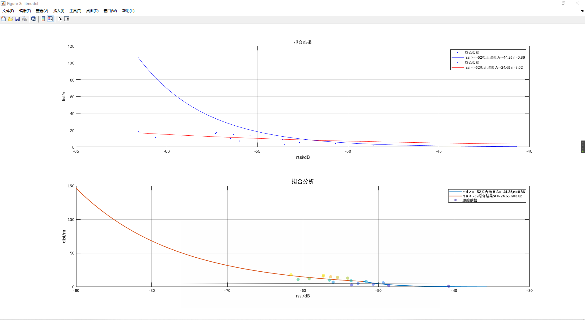
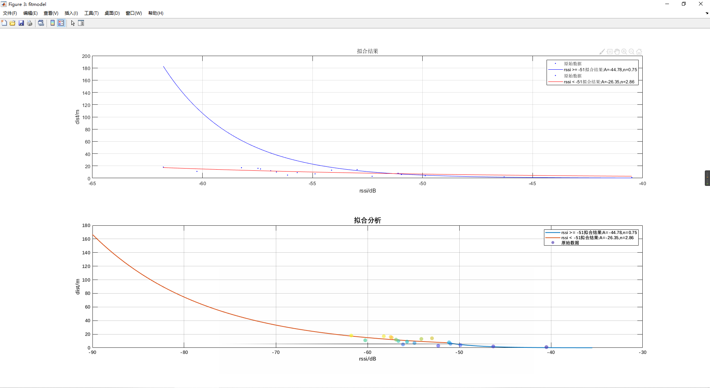
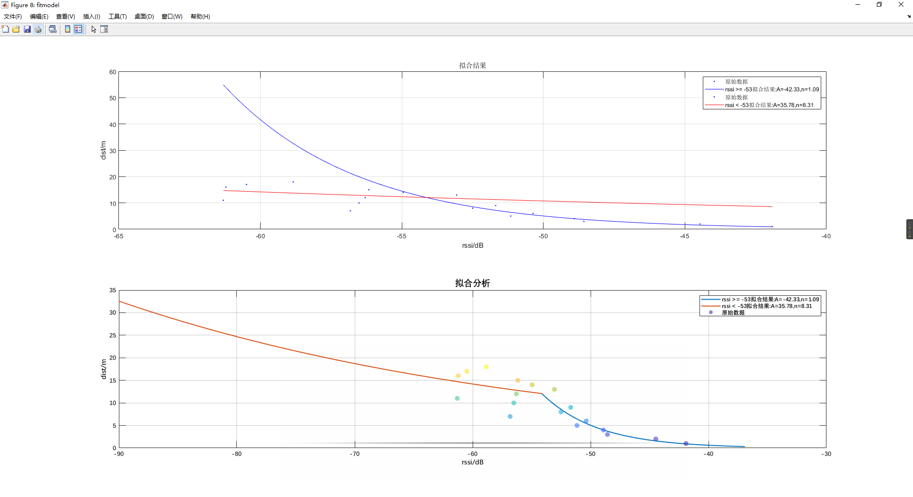
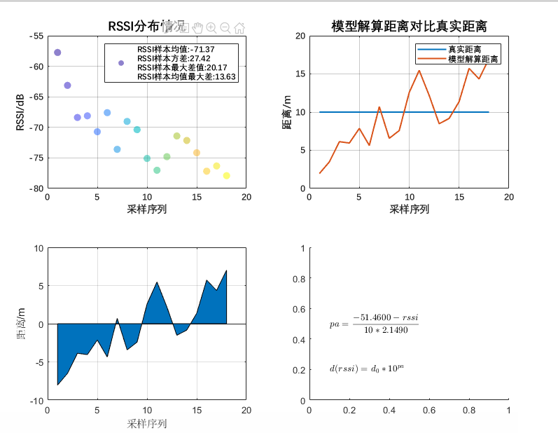

# 一、分段拟合

## 1、对数路径损耗模型

​	现有室内蓝牙定位（**Indoor BlueTooth Location**）方案是基于接收信号强度指示RSSI的多点定位方法 。**RSSI**测距的基本原理：无线信号传输中，信号强度随距离变化呈一定规律的衰减（**对数路径损耗模型**），根据采样信号构建路径衰减数学模型，然后将测量过程中的**RSSI**转换成距离最终计算测量点的位置。

对数路径损耗模型：
$$
\begin{align}
& \bold{Pl(d) = Pl(d_0) + 10nlg(d/d_0) + X_{\delta}}\\
\end{align}
$$
$Pl(d)$ ：未知节点在距离为d时对应的接收信号功率(dBm)；

$X_{\delta}$ ： 标准偏差为$\delta$的正态随机变量，$\delta $的取值与信号跳变过程相关；

不考虑信号跳变量$X_{\delta}$，通过上述公式可得：
$$
\begin{align}
&\bold{p(d)=A-10blg(d)} \\
\end{align}
$$

$$
\begin{align}
&\bold{d_1 = {\frac{A - RSSI}{10*b}}}\\
& \bold{d = 10^{d_1}}
\end{align}
$$


$A(A < 0)$：距离1m时，设备接收到无线信号的RSSI值；

$b(b>0)$：衰减系数；

$d(d>0)$：解算距离(m)；

$RSSI(RSSI<0)$ ：rssi观测值(db)；

## 2、分段拟合

​	从实验中发现，如果采用单一对数路径损耗模型存在以下不足：（1）以全局最优为拟合方式和拟合目标，得到的对数路径损耗模型中${n}$值偏小，当${RSSI}$ 值较小的情况下，解算出来的距离会偏大很多。（2）当${n}$值偏大的情况下，${RSSI}$较大的情况下，误差偏大。

​	为了解决上述问题，依据$RSSI$值将曲线分为两部分单独进行拟合，$pd_1(RSSI < RSSI_c)$ 和 ${pd_2(RSSI \geq const(RSSI_c)  )}$ 两个函数。拟合完成之后，将${pd_1 =pd_2}$ 对应的${RSSI_i}$ 作为后续解算分段的依据。

```c
todo:figure
```

## 3、分段拟合结果

​	在较为理想的情况下，测试RSSI和距离对应数据，并根据测试结果对8个锚节点（anchor）特征分别进行分段拟合。拟合结果如下：

### 3.1 one_pos_HLK_1


<file:D:\Code\BlueTooth\pos_bluetooth_matlab\attenuation_model\figure\one_pos_HLK_1分段拟合结果-1.fig>

rssi >= -50拟合结果:A=-46.44,n=0.36

```
 General model:
     fitresult_1(x) = power(10,(a-x)/10/b)
     Coefficients (with 95% confidence bounds):
       a =      -46.44  (-60.94, -31.94)
       b =      0.3551  (-1.296, 2.006)
```

rssi < -50拟合结果:A=-31.03,n=2.42

```
     General model:
     fitresult_2(x) = power(10,(a-x)/10/b)
     Coefficients (with 95% confidence bounds):
       a =      -31.03  (-45.54, -16.52)
       b =       2.424  (1.105, 3.743)
```

分段曲线交点RSSI:-49.08

```matlab
 AP_1 =  struct('Name','onepos_HLK_1',...
     'param_less_rssi',[-31.03,2.424],...
     'param_more_rssi',[-46.44,0.3551],...
     'piecewise_rssi', -49.08);
```

___________________

 ### 3.2 one_pos_HLK_2



<file:D:\Code\BlueTooth\pos_bluetooth_matlab\attenuation_model\figure\one_pos_HLK_1分段拟合结果-2.fig>

rssi >= -52拟合结果:A=-44.25,n=0.86

```
     General model:
     fitresult_1(x) = power(10,(a-x)/10/b)
     Coefficients (with 95% confidence bounds):
       a =      -44.25  (-56.21, -32.28)
       b =      0.8552  (-0.6993, 2.41)
```

rssi < -52拟合结果:A=-24.65,n=3.02

```
     General model:
     fitresult_2(x) = power(10,(a-x)/10/b)
     Coefficients (with 95% confidence bounds):
       a =      -24.65  (-56.66, 7.355)
       b =       3.018  (0.09569, 5.94)
```

分段曲线交点RSSI:-52.00

```matlab
AP_2 =  struct('Name','onepos_HLK_2',...
    'param_less_rssi',[-24.65,3.018],...
    'param_more_rssi',[ -44.25 ,0.8552],...
    'piecewise_rssi', -52);
```


___________________

 ### 3.3 one_pos_HLK_3



<file:D:\Code\BlueTooth\pos_bluetooth_matlab\attenuation_model\figure\one_pos_HLK_1分段拟合结果-3.fig>

rssi >= -51拟合结果:A=-44.78,n=0.75

```
General model:
     fitresult_1(x) = power(10,(a-x)/10/b)
     Coefficients (with 95% confidence bounds):
       a =      -44.78  (-51.35, -38.21)
       b =      0.7517  (-0.07243, 1.576)
```

​     

rssi < -51拟合结果:A=-26.35,n=2.86

```
     General model:
     fitresult_2(x) = power(10,(a-x)/10/b)
     Coefficients (with 95% confidence bounds):
       a =      -26.35  (-56.6, 3.894)
       b =       2.865  (0.1043, 5.625)
```

分段曲线交点RSSI:-51.33

```matlab
AP_3 =  struct('Name','onepos_HLK_3',...
    'param_less_rssi',[-26.35,2.86],...
    'param_more_rssi',[-44.78,0.75],...
    'piecewise_rssi', -51.33);
```


___________________

### 3.4 one_pos_HLK_4


<file:D:\Code\BlueTooth\pos_bluetooth_matlab\attenuation_model\figure\one_pos_HLK_1分段拟合结果-4.fig>

rssi >= -53拟合结果:A=-46.49,n=0.80

```
General model:
     fitresult_1(x) = power(10,(a-x)/10/b)
     Coefficients (with 95% confidence bounds):
       a =      -46.49  (-55.23, -37.75)
       b =      0.7952  (-0.2551, 1.845)
```

​     

rssi < -53拟合结果:A=-36.49,n=2.16

```
     General model:
     fitresult_2(x) = power(10,(a-x)/10/b)
     Coefficients (with 95% confidence bounds):
       a =      -36.49  (-55.77, -17.2)
       b =       2.161  (0.3905, 3.931)
```


分段曲线交点RSSI:-52.32

```matlab
AP_4 =  struct('Name','onepos_HLK_4',...
    'param_less_rssi',[-36.49,2.16],...
    'param_more_rssi',[-46.49,0.80],...
    'piecewise_rssi', -52.32);

```


___________________

 ### 3.5 one_pos_HLK_5


<file:D:\Code\BlueTooth\pos_bluetooth_matlab\attenuation_model\figure\one_pos_HLK_1分段拟合结果-5.fig>

rssi >= -53拟合结果:A=-44.01,n=1.02

```
     General model:
     fitresult_1(x) = power(10,(a-x)/10/b)
     Coefficients (with 95% confidence bounds):
       a =      -44.01  (-48.05, -39.98)
       b =       1.015  (0.5313, 1.499)
```

rssi < -53拟合结果:A=-30.28,n=2.78

```
     General model:
     fitresult_2(x) = power(10,(a-x)/10/b)
     Coefficients (with 95% confidence bounds):
       a =      -30.28  (-49.54, -11.03)
       b =       2.777  (1.034, 4.52)
```

分段曲线交点RSSI:-51.93

```matlab
AP_5 =  struct('Name','onepos_HLK_5',...
    'param_less_rssi',[-30.28,2.78],...
    'param_more_rssi',[-44.01,1.02],...
    'piecewise_rssi', -51.93);

```


___________________

 ### 3.6 one_pos_HLK_6


<file:D:\Code\BlueTooth\pos_bluetooth_matlab\attenuation_model\figure\one_pos_HLK_1分段拟合结果-6.fig>

rssi >= -59拟合结果:A=-45.45,n=1.71

```
     General model:
     fitresult_1(x) = power(10,(a-x)/10/b)
     Coefficients (with 95% confidence bounds):
       a =      -45.45  (-68.74, -22.15)
       b =       1.707  (-1.589, 5.003)
```


rssi < -59拟合结果:A=-6.33,n=5.36

```
     General model:
     fitresult_2(x) = power(10,(a-x)/10/b)
     Coefficients (with 95% confidence bounds):
       a =      -6.327  (-87.73, 75.08)
       b =       5.365  (-2.017, 12.75)
```

分段曲线交点RSSI:-63.70

```matlab
AP_6 =  struct('Name','onepos_HLK_6',...
    'param_less_rssi',[-6.33,5.36],...
    'param_more_rssi',[-45.45,1.71],...
    'piecewise_rssi', -63.70);
```


___________________

 ### 3.7 one_pos_HLK_7


<file:D:\Code\BlueTooth\pos_bluetooth_matlab\attenuation_model\figure\one_pos_HLK_1分段拟合结果-7.fig>

rssi >= -62拟合结果:A=-44.91,n=1.61

```
     General model:
     fitresult_1(x) = power(10,(a-x)/10/b)
     Coefficients (with 95% confidence bounds):
       a =      -44.91  (-59.68, -30.15)
       b =       1.607  (0.06736, 3.147)
```

rssi < -62拟合结果:A=-8.61,n=5.11

```
General model:
     fitresult_2(x) = power(10,(a-x)/10/b)
     Coefficients (with 95% confidence bounds):
       a =      -8.611  (-196.9, 179.7)
       b =       5.111  (-11.49, 21.71)
```

​     

分段曲线交点RSSI:-61.56

```matlab
AP_7 =  struct('Name','onepos_HLK_7',...
    'param_less_rssi',[-8.61,5.11],...
    'param_more_rssi',[-44.91,1.61],...
    'piecewise_rssi', -61.56);
```


___________________

 ### 3.8 one_pos_HLK_8



<file:D:\Code\BlueTooth\pos_bluetooth_matlab\attenuation_model\figure\one_pos_HLK_1分段拟合结果-7.fig>

rssi >= -53拟合结果:A=-42.33,n=1.09

```
     General model:
     fitresult_1(x) = power(10,(a-x)/10/b)
     Coefficients (with 95% confidence bounds):
       a =      -42.33  (-47.12, -37.55)
       b =       1.091  (0.509, 1.673)
```

rssi < -53拟合结果:A=35.78,n=8.31

```
     General model:
     fitresult_2(x) = power(10,(a-x)/10/b)
     Coefficients (with 95% confidence bounds):
       a =       35.78  (-205.9, 277.5)
       b =       8.315  (-13.12, 29.74)
```

分段曲线交点RSSI:-54.13

```matlab
AP_8 =  struct('Name','onepos_HLK_8',...    'param_less_rssi',[35.78,8.315],...    'param_more_rssi',[-42.33,1.09],...    'piecewise_rssi', -54.13);
```


___________________

## 4、偏置拟合结果

​	蓝牙anchor点发送的rssi-reference作为参考值${RSSI_r}$，对比理想测试条件下1m处的RSSI值${RSSI_1}$，将上述两值的差作为偏置量，将理想测试条件下的RSSI值叠加上偏置量，将带有偏置量的数据进行拟合获取拟合结果如下。

​	从拟合的结果看，采用分段对数模型错位拟合目标函数，以标准测试结果偏置后5m处对应的RSSI 作为拟合的分段，拟合出的两条曲线可能会出现在有效测试距离内(距离<18米的rssi中无法找到两条曲线交点的情况)。

```matlab
## AP:1 拟合结果
 ### 分段RSSI:-60.7
rssi >= -62拟合结果:A=-44.16,n=2.47
     General model:
     fitresult_1(x) = power(10,(a-x)/10/b)
     Coefficients (with 95% confidence bounds):
       a =      -44.16  (-87.08, -1.228)
       b =       2.474  (-3.97, 8.917)
rssi < -62拟合结果:A=-21.28,n=4.17
     General model:
     fitresult_2(x) = power(10,(a-x)/10/b)
     Coefficients (with 95% confidence bounds):
       a =      -21.28  (-80.41, 37.85)
       b =       4.168  (-1.096, 9.432)
分段曲线交点RSSI:-77.55
___________________
## AP:2 拟合结果
 ### 分段RSSI:-60.1
rssi >= -62拟合结果:A=-48.24,n=1.70
     General model:
     fitresult_1(x) = power(10,(a-x)/10/b)
     Coefficients (with 95% confidence bounds):
       a =      -48.24  (-72.1, -24.38)
       b =       1.704  (-1.599, 5.006)
rssi < -62拟合结果:A=-27.89,n=3.55
     General model:
     fitresult_2(x) = power(10,(a-x)/10/b)
     Coefficients (with 95% confidence bounds):
       a =      -27.89  (-75.88, 20.1)
       b =       3.554  (-0.795, 7.903)
分段曲线交点RSSI:-66.98
___________________
## AP:3 拟合结果
 ### 分段RSSI:-59.5
rssi >= -66拟合结果:A=-40.17,n=2.61
     General model:
     fitresult_1(x) = power(10,(a-x)/10/b)
     Coefficients (with 95% confidence bounds):
       a =      -40.17  (-74.86, -5.49)
       b =       2.615  (-1.318, 6.547)
rssi < -66拟合结果:A=-8.62,n=5.16
     General model:
     fitresult_2(x) = power(10,(a-x)/10/b)
     Coefficients (with 95% confidence bounds):
       a =      -8.624  (-160.6, 143.4)
       b =       5.163  (-7.99, 18.32)
分段曲线交点RSSI:-72.55
___________________
## AP:4 拟合结果
 ### 分段RSSI:-62.4
rssi >= -64拟合结果:A=-47.02,n=1.67
     General model:
     fitresult_1(x) = power(10,(a-x)/10/b)
     Coefficients (with 95% confidence bounds):
       a =      -47.02  (-66.95, -27.08)
       b =       1.668  (-0.4423, 3.778)
rssi < -64拟合结果:A=-51.36,n=1.47
     General model:
     fitresult_2(x) = power(10,(a-x)/10/b)
     Coefficients (with 95% confidence bounds):
       a =      -51.36  (-69.55, -33.17)
       b =       1.468  (-0.1266, 3.064)
分段曲线交点RSSI:-83.33
___________________
## AP:5 拟合结果
 ### 分段RSSI:-61.6
rssi >= -63拟合结果:A=-46.42,n=1.97
     General model:
     fitresult_1(x) = power(10,(a-x)/10/b)
     Coefficients (with 95% confidence bounds):
       a =      -46.42  (-64.93, -27.91)
       b =       1.971  (-0.421, 4.364)
rssi < -63拟合结果:A=-9.70,n=5.25
     General model:
     fitresult_2(x) = power(10,(a-x)/10/b)
     Coefficients (with 95% confidence bounds):
       a =        -9.7  (-115.5, 96.08)
       b =       5.249  (-4.101, 14.6)
分段曲线交点RSSI:-68.51
___________________
## AP:6 拟合结果
 ### 分段RSSI:-60.2
rssi >= -64拟合结果:A=-45.53,n=2.14
     General model:
     fitresult_1(x) = power(10,(a-x)/10/b)
     Coefficients (with 95% confidence bounds):
       a =      -45.53  (-67.13, -23.93)
       b =       2.143  (-0.6747, 4.961)
rssi < -64拟合结果:A=57.80,n=11.22
     General model:
     fitresult_2(x) = power(10,(a-x)/10/b)
     Coefficients (with 95% confidence bounds):
       a =        57.8  (-342.3, 457.9)
       b =       11.22  (-24.3, 46.74)
分段曲线交点RSSI:-69.92
___________________
## AP:7 拟合结果
 ### 分段RSSI:-62.0
rssi >= -64拟合结果:A=-48.56,n=1.82
     General model:
     fitresult_1(x) = power(10,(a-x)/10/b)
     Coefficients (with 95% confidence bounds):
       a =      -48.56  (-66.02, -31.11)
       b =       1.823  (-0.5158, 4.161)
rssi < -64拟合结果:A=24.84,n=8.39
     General model:
     fitresult_2(x) = power(10,(a-x)/10/b)
     Coefficients (with 95% confidence bounds):
       a =       24.84  (-190.5, 240.2)
       b =       8.388  (-10.97, 27.74)
分段曲线交点RSSI:-68.94
___________________
## AP:8 拟合结果
 ### 分段RSSI:-57.1
rssi >= -59拟合结果:A=-49.17,n=1.35
     General model:
     fitresult_1(x) = power(10,(a-x)/10/b)
     Coefficients (with 95% confidence bounds):
       a =      -49.17  (-55.43, -42.9)
       b =       1.348  (0.4052, 2.292)
rssi < -59拟合结果:A=-8.04,n=5.20
     General model:
     fitresult_2(x) = power(10,(a-x)/10/b)
     Coefficients (with 95% confidence bounds):
       a =      -8.036  (-77.16, 61.09)
       b =       5.196  (-1.025, 11.42)
分段曲线交点RSSI:-63.58
```

## 5、结论

​	使用分段拟合方法对不同的蓝牙信标进行拟合，能够解决存在的以下问题：

1. 不同蓝牙信标测试出来的标准距离-RSSI曲线特性差异较大的问题；
2. 使用单个对数模型在某些拟合情况下，RSSI较小(<-80dbm)的时候通过模型计算出来的距离出现严重偏差。

  但是会存在以下问题：

1. 需要拟合的参数较多，且在一些特殊情况下，分段函数曲线无法相交于一点的；
2. 分段点的选取没有较好的参考性，且分段依据为RSSI值；
3. 距离-RSSI标准测试是在较为理想的情况下进行的，在实际的使用中，越是理想的拟合模型反而不能有效的反应距离和RSSI的对应关系；

# 二、均值对数模型分析


## 1、多模型分段拟合

多模型分段存在以下不足：

1. 根据不同AP所采集的标准数据分段拟合对数模型；
2. 标准数据采集的过程比较理想化，没有考虑实际使用过程中存在的影响因素；
3. 不同的AP标准数据不满足基本的距离-RSSI衰减变化趋势；
4. 将实际使用过程中的影响RSSI因素考虑进来，对数模型基本不能准确反映距离值；

标准DIST-RSSI测试结果-不同AP对比如图：


<file:D:\Code\BlueTooth\pos_bluetooth_matlab\attenuation_model\figure\8个AP统计结果-距离-rssi均值-对比分析.fig>

依据参考RSSI值对上述数据进行y轴平移后的标准DIST-RSSI测试结果-不同AP如图：


<file:D:\Code\BlueTooth\pos_bluetooth_matlab\attenuation_model\figure\8个AP统计结果-距离-rssi均值-delta-1.fig>

## 2、均值对数模型

为了解决上述部分问题，提出如下解决方案：

1. 计算所有ap在不同距离下采集的RSSI的均值；
2. 根据上述结果，引入环境因子${\Delta_{env}}$ 。

所有ap均值同原有单个ap均值DIST-RSSI对比如图：


<file:D:\Code\BlueTooth\pos_bluetooth_matlab\attenuation_model\figure\所有ap固定距离rssi均值同单个ap均值对比.fig>

## 3、引入环境因子

引入环境因子后的模型：
$$
\begin{align}
&\bold{p(d)=A-10blg(d)+\Delta_{env}} \\
\end{align}
$$

$$
\begin{align}
&\bold{d_1 = {\frac{A - RSSI+\Delta_{env}}{10*b}}}\\
& \bold{d = 10^{d_1}}
\end{align}
$$


$A(A < 0)$：距离1m时，设备接收到无线信号的RSSI值；

$b(b>0)$：衰减系数；

$d(d>0)$：解算距离(m)；

$RSSI(RSSI<0)$ ：rssi观测值(db)；

引入环境因子后的模型拟合结果如图：




## 4、结论


$$
\begin{align}
& \bold{d(rssi) =d_0*10^\frac{ -51.4600-rssi}{10*2.149}}\\
\end{align}
$$
从拟合结果看，将环境因子${\Delta_{env}}$ 设置为-15，拟合出来的结果较好，且距离为1时的rssi值同ap参考值基本一致；

上述方案具备以下优点：

- 相比较于分段拟合模型更简单；
- **方便后期的模型自适应拟合**；
- 能较好地应对实际使用情况；

# 三、高斯滤波和均值滤波


