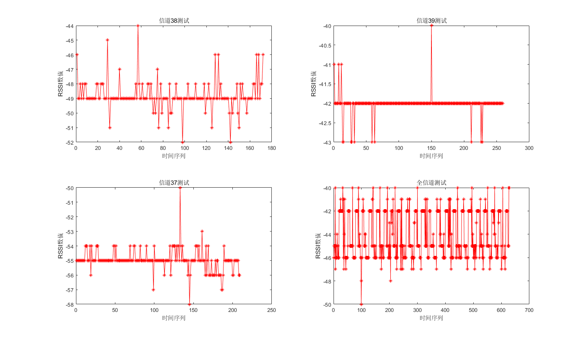

# AP接收RSSI三值问题

## 问题背景

​	测试中发现，HLK-2和HLK-4在一定的条件下会出现如下图所示的情况。接收端收到的RSSI值绝大部分为两个固定的值跳动。同样测试条件下，HLK-3和HLK-1不会出现这种现象。

    
    

        beacon2和beacon4两值波动图
    

    

    beacon2和beacon4两值波动图统计直方图

​	

测试结果表明：

​	beacon2（HLK-2）主要有三个值：-63、-61、-54；统计特性：均值-58.4，方差19.6。

​	beacon4（HLK-4）主要有三个值：-65、-52、-49；统计特性：均值-55.3，方差48.4。

## 对比实验

​	为了重现上述现象，设计了两个对比实验。

测试实验设计

| 运行情况 | 距离 |
| -------- | ---- |
| 单独测试 | 1m   |
| 混合测试 | 2m   |

    
    

        beacon2和beacon4两值波动图
    

从上图可以看到，不同的测试条件下的测试结果存在较大差异。其中多beacon-1m测试条件下，出现了明显的三值现象。其他不同测试条件下，亦存在类似的现象。相比较于其他测试下没有那么明显。

初步判断为受到蓝牙跳频影响。

## 跳频测试

    
    

        不同信道测试结果
    

