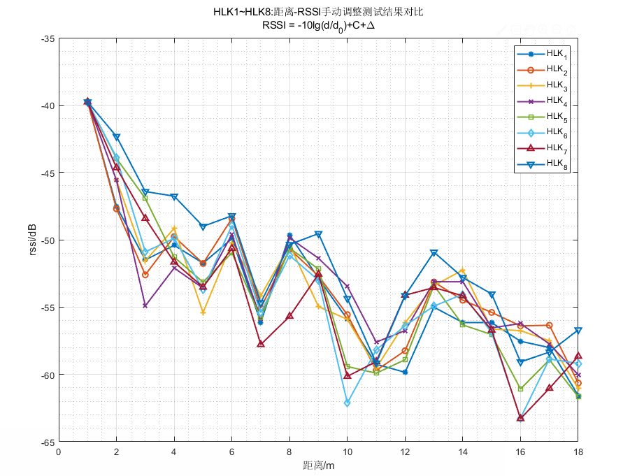
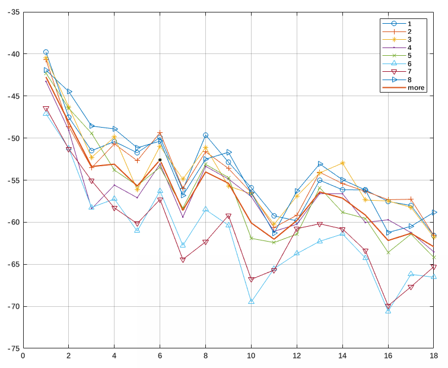
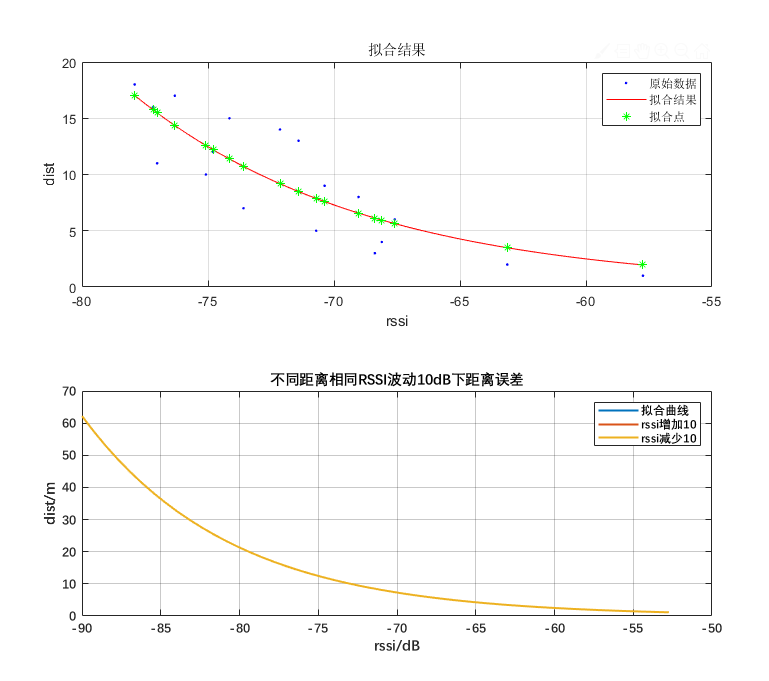

# 均值对数模型分析

    2021-04-23 15:45

## 0x00

现有方法存在不足：

1. 根据不同AP所采集的标准数据分段拟合对数模型；
2. 标准数据采集的过程比较理想化，没有考虑实际使用过程中存在的影响因素；
3. 不同的AP标准数据不满足基本的距离-RSSI衰减变化趋势；
4. 将实际使用过程中的影响RSSI因素考虑进来，对数模型基本不能准确反映距离值；

标准RSSI-DIST测试结果-不同AP如图：

依据参考RSSI值对上述数据进行y轴平移后的标准RSSI-DIST测试结果-不同AP如图：

## 0x01

为了解决上述部分问题，提出如下解决方案：

1. 计算所有ap在不同距离下采集的RSSI的均值；
2. 根据上述结果，引入环境因子${\Delta_{env}}$ 。

所有ap均值同原有单个ap均值RSSI-DIST对比如图：

## 0x02

引入环境因子后的模型：
$$
\begin{align}
&\bold{p(d)=A-10blg(d)+\Delta_{env}} \\
\end{align}
$$

$$
\begin{align}
&\bold{d_1 = {\frac{A - RSSI+\Delta_{env}}{10*b}}}\\
& \bold{d = 10^{d_1}}
\end{align}
$$

$A(A < 0)$：距离1m时，设备接收到无线信号的RSSI值；

$b(b>0)$：衰减系数；

$d(d>0)$：解算距离(m)；

$RSSI(RSSI<0)$ ：rssi观测值(db)；

引入环境因子后的模型拟合结果如图：

$$
\begin{align}
& d(rssi) = -51.4600 - \frac{rssi}{10*2.149}\\
\end{align}
$$
从拟合结果看，将环境因子${\Delta_{env}}$ 设置为-15，拟合出来的结果较好，且距离为1时的rssi值同ap参考值基本一致；

上述方案具备以下优点：

- 相比较于分段拟合模型更简单；
- **方便后期的模型自适应拟合**；
- 能较好地应对实际使用情况；

...